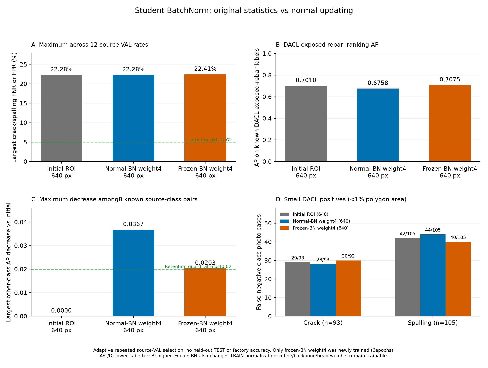

# 학생 모델 BatchNorm 원래 통계 유지 후속 실험

이전 weight4의 반복 source-VAL 결과와 가중치 변화 관찰 뒤, student BatchNorm 정책 하나를 선택했다. 원래0773에서 frozen-BN weight4를 새로6epoch 학습하고 완료된 normal-BN weight4 대조6epoch를 그대로 재사용했다. 대조군을 재학습하거나 이전6epoch를 새 비용에 더하지 않았다.
각 model.train() 직후 student의47개 BatchNorm을 eval로 바꿔 running mean·variance·num_batches_tracked 총141개 버퍼를 원래 값으로 유지했다. 12,328개 채널, γ/β94개 파라미터 tensor는 학습 가능하며 backbone·head 파라미터도 계속 학습한다. eps·momentum을 바꾸지 않았다.
이 정책은 TRAIN 정규화도 minibatch 통계에서 원래 running 통계 사용으로 바꾼다. 단순 저장 시 통계 보정이 아니며 BatchNorm affine·backbone·head 가중치 전체를 동결한 실험도 아니다.
두 군의 원래 추출 순서·난수·640 입력·80×80 마스크·원본 주석·손실 가중치·teacher weight4/T2는 같다. 알려진 다른5종의 frozen0773 Bernoulli KL을 유지하고 균열·박락·미확인 출처 항목은 증류 손실에서 제외했다. teacher 신호는 정규화이며 새 정답이 아니다.
앞선 BN running 통계와 성능 변화의 동시 관찰은 후속 실험을 정한 근거이며 오류 원인이나 이번 성능 개선의 인과 증거가 아니다.

| 모델 | 이번 새 epoch | 실제 epoch | 선택 epoch | 최대 검증 미탐·오탐 | 엄격한5% 기준 |
|---|---:|---:|---:|---:|---|
| 추가 학습 전 ROI 모델 | 0 | 6 | 6 | 22.28% | 미달 |
| 재사용 normal-BN weight4 | 0 | 6 | 3 | 22.28% | 미달 |
| 후속 frozen-BN weight4 | 6 | 6 | 4 | 22.41% | 미달 |

frozen-BN−초기 최대 오류 +0.13pp, frozen-BN−normal-BN weight4 대조 +0.13pp. 양수는 악화다.
최대값은 균열·박락 × DACL710/Dam424/CODEBRIM611 × FNR/FPR의12개 비율 중 최대이며 전체 사진 오답 비율·앱 정확도가 아니다.

## 항목 유지 기준과 AP

동일 공식의 유지 후보 기준: **미달**. 알려진 다른 항목별 AP 하락이 초기 대비0.02 이하, DACL 철근 노출 AP 회복이 이번 normal-BN weight4 대조 대비0.02 이상, 최대 균열·박락 오류 악화가 초기·이번 대조 각각 대비2pp 이하여야 한다. 이전 weight0을 새 대조 대신 사용하거나 기준을 완화하지 않았다.

| 출처 | 다른 항목 | 초기 AP | normal-BN4 AP | frozen-BN4 AP | frozen−초기 | frozen−대조 |
|---|---|---:|---:|---:|---:|---:|
| dacl | 녹 흔적 | 0.8771 | 0.8757 | 0.8828 | +0.0056 | +0.0071 |
| dacl | 철근 노출 | 0.7010 | 0.6758 | 0.7075 | +0.0065 | +0.0317 |
| dacl | 젖은 표면 | 0.5127 | 0.5303 | 0.5216 | +0.0089 | -0.0087 |
| dacl | 백화 | 0.7545 | 0.7554 | 0.7580 | +0.0035 | +0.0026 |
| dacl | 공동 | 0.6045 | 0.5935 | 0.5842 | -0.0203 | -0.0094 |
| codebrim | 녹 흔적 | 0.8769 | 0.8626 | 0.8955 | +0.0186 | +0.0329 |
| codebrim | 철근 노출 | 0.9660 | 0.9696 | 0.9633 | -0.0027 | -0.0063 |
| codebrim | 백화 | 0.8298 | 0.7931 | 0.8436 | +0.0138 | +0.0505 |

DACL 철근 노출 AP: 초기 **0.7010**, normal-BN4 **0.6758**, frozen-BN4 **0.7075**. 이번 대조 대비 회복 +0.0317.
AP는 확률 순위 지표이며 정답률·오탐률이 아니다. 다른5종의 알려진 조합8개×3모델=24개 AP, 전체7종 알려진 조합14개×3모델=42개 AP를 동일 정답·양성 분모에서 확인했다. 미확인 항목에0점 AP·정상 정답을 만들지 않았다.

## 기존 연구 기준과 작은 손상

기존 연구 후보 기준: **미달**. 초기0773·이번 normal-BN4 대조 각각 대비 최대 오류0.5pp 이상 개선, 각 target 오류 악화2pp 이하, 다른 알려진 AP 하락0.02 이하, 작은 FN합계2건 이상 감소·항목별 FNR 악화2pp 이하를 요구했다. 유지·연구·엄격한5%는 독립 기준이다.

| 작은 손상 | 초기 FN/양성 | normal-BN4 FN/양성 | frozen-BN4 FN/양성 |
|---|---:|---:|---:|
| 균열 | 29/93 | 28/93 | 30/93 |
| 박락 | 42/105 | 44/105 | 40/105 |

작은 양성은 균열93·박락105의198개 항목·사진 사례다. 같은 사진이 두 항목에 들어갈 수 있으며 고유 사진198장·실제 물리적 손상 크기가 아니다.

## 출처별 관측 오류

Wilson95% 구간은 고정 예측·독립 사진 가정의 기술 통계다. 반복 VAL epoch·임계값·후속 정책 선택을 보정한 현장 보장·모델 간 유의성 검정이 아니다.

| 모델 | 출처 | 항목 | FN/양성 | 미탐률 | FP/음성 | 오탐률 |
|---|---|---|---:|---:|---:|---:|
| 추가 학습 전 ROI 모델 | dacl | 균열 | 47/211 | 22.27% | 110/499 | 22.04% |
| 추가 학습 전 ROI 모델 | damsegment | 균열 | 2/248 | 0.81% | 1/176 | 0.57% |
| 추가 학습 전 ROI 모델 | codebrim | 균열 | 11/149 | 7.38% | 58/462 | 12.55% |
| 추가 학습 전 ROI 모델 | dacl | 박락 | 72/324 | 22.22% | 86/386 | 22.28% |
| 추가 학습 전 ROI 모델 | damsegment | 박락 | 11/58 | 18.97% | 8/366 | 2.19% |
| 추가 학습 전 ROI 모델 | codebrim | 박락 | 15/140 | 10.71% | 42/471 | 8.92% |
| 재사용 normal-BN weight4 | dacl | 균열 | 44/211 | 20.85% | 103/499 | 20.64% |
| 재사용 normal-BN weight4 | damsegment | 균열 | 6/248 | 2.42% | 0/176 | 0.00% |
| 재사용 normal-BN weight4 | codebrim | 균열 | 13/149 | 8.72% | 53/462 | 11.47% |
| 재사용 normal-BN weight4 | dacl | 박락 | 72/324 | 22.22% | 86/386 | 22.28% |
| 재사용 normal-BN weight4 | damsegment | 박락 | 10/58 | 17.24% | 9/366 | 2.46% |
| 재사용 normal-BN weight4 | codebrim | 박락 | 16/140 | 11.43% | 43/471 | 9.13% |
| 후속 frozen-BN weight4 | dacl | 균열 | 44/211 | 20.85% | 105/499 | 21.04% |
| 후속 frozen-BN weight4 | damsegment | 균열 | 2/248 | 0.81% | 3/176 | 1.70% |
| 후속 frozen-BN weight4 | codebrim | 균열 | 11/149 | 7.38% | 53/462 | 11.47% |
| 후속 frozen-BN weight4 | dacl | 박락 | 72/324 | 22.22% | 83/386 | 21.50% |
| 후속 frozen-BN weight4 | damsegment | 박락 | 13/58 | 22.41% | 5/366 | 1.37% |
| 후속 frozen-BN weight4 | codebrim | 박락 | 17/140 | 12.14% | 40/471 | 8.49% |

## 이번 비용·BN·teacher·자료 보존

이번 새 학습6epoch·대조군 재학습0epoch다. 학습·epoch 검증 19.07분, allocated peak 2.079GiB, 실제 update 10679, AMP skip 7, teacher forward 10686회다.
실제6epoch 모두141개 BN 버퍼 SHA가 초기와 같고47개 BN이 eval임을 확인했다. 각 epoch 마지막 minibatch에서 학습 가능한94개 affine의 gradient가 존재·유한하고 일부가0이 아님을 확인했다. 모든 minibatch의 gradient나 모든 affine의 실제 update를 동일하게 검증했다는 뜻은 아니다.
학습 전 commit의 86개 실행 소스, 코드 테스트 32개 통과와 새·재사용 가중치 CPU 재로딩·finite7/80/19 계약을 확인했다. 테스트 수는 정확도 사례 수가 아니다. 원래 full TRAIN14,248·전체26,289행의 이미지·마스크·known·주석·auxiliary·추출/손실 가중치 및 모든7종 draw 노출을 유지했다.
teacher의 초기·최종 state SHA·eval·gradient 부재를 유지했다. 원본 입력 SHA·size·mtime와 이전 소스·체크포인트·최종 평가 기록을 보존했다. AP loader·캐시 검증 뒤 유한·비음수·known 분모 이내의 정확한 정수값 float 양성 개수만 int로 표시하며 점수·정답·AP·임계값을 바꾸지 않았다.

## 적용 상태와 한계

보류 TEST 추론·자동 배포·앱 모델 승격은 하지 않았다. 기본 `facility-validation-v2`와 프로필 SHA를 유지했다. 새 독립 사진·원본 라벨 변경·전문가 확정 라벨·새 사진/픽셀 정답은0개다.
공개 교량·댐 콘크리트, 한 seed, 반복 source-VAL에 따른 정책 선택과 사진 존재 분류 연구다. 공장 사진·정밀 위치·구조 안전·미래 현장 오차는 측정하지 않았다. 반복 VAL 적응 결과를 독립 평가나 현장5% 미만 보장으로 설명하지 않으며 최종 판단은 점검자가 한다.

[고정 BN 정책](facility-batchnorm-study-protocol.json), [실측 집계](facility-batchnorm-study-comparison.json), [기술 검증](facility-batchnorm-study-verification.json), [이전 weight4 결과](FACILITY_RETENTION_STRENGTH_STUDY_RESULTS_KO.md)
