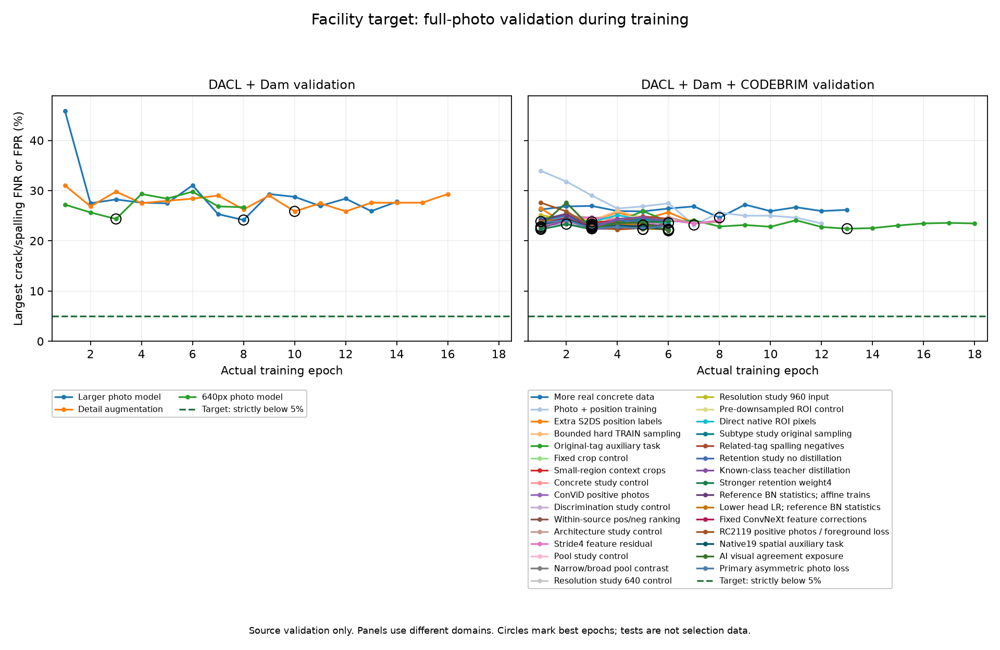

# 시설 항목별 5% 목표 진행·결과

**5% 미만 목표 미달.**

기록된 완료 학습은 총256epoch이다. 현재 모델 실행 기록254epoch와 보존한 중단 실행 기록2epoch를 합산했다. 모델 확률 평균 검증은 학습 횟수에 더하지 않는다.
해상도 대조 실험의 계획 예산은 640·960 각각6epoch, 합계12epoch이다. 현재 두 모델의 완료 기록은 12epoch이며 중단 실행의 2epoch는 모델 비교 예산·성능 표에 포함하지 않고 누적 학습량에만 별도 더한다.
원본 ROI 대조 실험도 각6epoch·합계12epoch의 고정 예산이며 완료 기록은 12epoch이다. 같은 원본 RGB와 기존 crop 범위에서 사전 축소 유무를 비교하고 양군을 640 PNG로 맞췄다. 독립 사진·정답·full row는 추가하지 않는다.
박락 음성 태그 대조 실험도 각6epoch·합계12epoch의 고정 예산이며 완료 기록은 12epoch이다. 같은 원본640 TRAIN에서 관련4태그 음성의 추출 빈도만 높이고 모든 위치의 출처·full/crop·균열/박락 정답과 손실 가중치를 유지한다. 다른5항목·보조태그 노출 변화는 별도로 평가한다.
기존 항목 보존 실험도 각6epoch·합계12epoch의 고정 예산이며 완료 기록은 12epoch이다. 두 조건에서 원본 사진 순서와 교사 추론을 같게 맞추고, 알려진 다른5항목의 증류 손실 가중치0·1만 비교한다. 교사 확률은 새로운 정답이 아니다.
보존 강도 후속 후보의 신규 예산은6epoch이며 완료 기록은 6epoch이다. 가중치4만 새로 학습하고 이미 완료한 가중치0 대조군을 재사용하므로 대조군6epoch를 다시 합산하지 않는다.
BN 통계 고정 후보의 신규 예산은6epoch이며 완료 기록은 6epoch이다. 같은 가중치4 조건에서 학생 BN을 원본 평균·분산으로 정규화하고 학습 계수는 유지한다. 일반 BN 가중치4 대조군은 재사용해 다시 합산하지 않는다.
head 학습률 후속 후보의 신규 예산은6epoch이며 완료 기록은 6epoch이다. 같은 원본 초기 모델·BN 정책·가중치4 조건에서 non-backbone 초기 학습률만0.00025→0.0001로 낮춘다. 기존 BN 고정 대조군을 재사용해 학습 횟수를 다시 더하지 않는다.
사전학습 특징 추가 후보의 신규 예산은6epoch이며 완료 기록은 6epoch이다. 고정된 ImageNet ConvNeXt 특징에서 지도·사진·보조 점수 보정 연결층을 학습한다. 기존 head1e-4 대조군을 재사용하며 새 시설 정답은 추가하지 않는다. 모델 크기와 추가 encoder 연산 비용은 별도로 보고한다.
원본19종 위치 보조 후보의 신규 예산은6epoch이며 완료 기록은 6epoch이다. 기존 DACL TRAIN 전체 사진6,225장의 원본 폴리곤에만 독립19종 위치 손실0.1을 추가한다. 부분 사진·다른 출처·부적합 채널은 미확인이다. 기존 대조군은 재학습하지 않으며 새 독립 사진은0장이다.
AI 사진 검토 후보의 신규 예산은6epoch이며 완료 기록은 6epoch이다. TRAIN 사진200장을 AI가 검토하고 두 항목 모두 명확하며 원본 주석과 일치하는31장에 epoch당2회 추가 노출했다. 같은 출처·전체 사진·7종 정답/미확인 상태를 가진 기존 추출 위치만 바꾼다. AI 판단을 사람 검수나 새 정답으로 취급하지 않는다.
균열·박락 비대칭 사진 손실 후보의 신규 예산은6epoch이며 완료 기록은 6epoch이다. 원본 추출 순서와 모든 정답은 유지하고 주항목의 사진 손실만gamma_pos0/gamma_neg4/clip0.05로 바꾼다. 다른5종·위치·19종 보조·교사 증류 계산을 유지하며, 원본 사진12장 AI 재검토는 진단 기록으로만 사용한다.
직전 해상도 비교의 대조군은 실행 세션 중단 뒤 optimizer 상태를 복구할 수 없어 같은 초기 모델·고정 조건으로 처음부터 다시 시작했다. 중단 당시 완료하지 못한 epoch의 배치·업데이트·시간은 정량 기록이 없어 추정 합산하지 않는다. [보존한 중단 집계](facility-resolution-interruption.json)를 함께 기록한다.
동일한 세 검증 자료에서 뷰·임계값 선택 고정이 끝난 최대 오류 최소 관측 모델: `facility-presence-target-head-lr-low`, 최대 미탐·오탐 22.02%. 연구 후보 선정과 앱 배포 기준 통과는 별도다.
검증 미달 후보를 반복 시험하여 설정을 고르지 않았다. 목표를 통과했을 때 수행할 별도 추가1epoch 조건도 아직 발동하지 않았다.
현재 결과는 추가 반복으로5%달성을 보장하지 않는다. 정답 기준의 전문가 검수와 다른 모델 구조를 포함한 후속 연구가 필요하다.

균열·박락 각각에 대해 미탐률 FN/(TP+FN), 오탐률 FP/(FP+TN)이 모두 0.05 미만이어야 통과한다.
아래 최대 오류는 이 두 항목의 자료별 미탐/오탐 중 가장 큰 비율이며 전체 오답 사진 비율이나 정확도는 아니다.

| 시도 | 상태 | 실제 epoch | 입력 | 검증 자료 | 최대 검증 오류 | 목표 |
|---|---|---:|---:|---|---:|---|
| 큰 사진 모델 | 학습 완료 | 14 | 384 | 기존 교량, 추가 댐 | 24.14% | 미달/미확인 |
| 상세 조각·자료 균형 | 학습 완료 | 16 | 384 | 기존 교량, 추가 댐 | 25.86% | 미달/미확인 |
| 640 해상도 | 학습 완료 | 8 | 640 | 기존 교량, 추가 댐 | 24.35% | 미달/미확인 |
| 실제 CODEBRIM 추가 | 학습 완료 | 13 | 640 | 기존 교량, 추가 댐, CODEBRIM 교량 | 24.61% | 미달/미확인 |
| 사진·위치 동시 학습 | 학습 완료 | 12 | 640 | 기존 교량, 추가 댐, CODEBRIM 교량 | 23.15% | 미달/미확인 |
| S2DS 위치 정답 추가 | 학습 완료 | 7 | 640 | 기존 교량, 추가 댐, CODEBRIM 교량 | 23.32% | 미달/미확인 |
| 어려운 TRAIN 사례 보강 | 학습 완료 | 6 | 640 | 기존 교량, 추가 댐, CODEBRIM 교량 | 23.83% | 미달/미확인 |
| 원본19종 보조 학습 | 학습 완료 | 18 | 640 | 기존 교량, 추가 댐, CODEBRIM 교량 | 22.41% | 미달/미확인 |
| 작은 영역 비교: 기존 자료 대조군 | 학습 완료 | 6 | 640 | 기존 교량, 추가 댐, CODEBRIM 교량 | 22.28% | 미달/미확인 |
| 작은 영역 비교: 맥락 crop 보강군 | 학습 완료 | 6 | 640 | 기존 교량, 추가 댐, CODEBRIM 교량 | 23.15% | 미달/미확인 |
| 콘크리트 사진 비교: 기존 자료 대조군 | 학습 완료 | 6 | 640 | 기존 교량, 추가 댐, CODEBRIM 교량 | 22.80% | 미달/미확인 |
| 콘크리트 사진 비교: ConViD 양성 보강군 | 학습 완료 | 6 | 640 | 기존 교량, 추가 댐, CODEBRIM 교량 | 22.85% | 미달/미확인 |
| 균열·박락 구분: 기존 손실 대조군 | 학습 완료 | 6 | 640 | 기존 교량, 추가 댐, CODEBRIM 교량 | 23.06% | 미달/미확인 |
| 균열·박락 구분: 양성·음성 순위 학습군 | 학습 완료 | 6 | 640 | 기존 교량, 추가 댐, CODEBRIM 교량 | 22.28% | 미달/미확인 |
| 모델 구조 비교: 기존 모델 대조군 | 학습 완료 | 8 | 640 | 기존 교량, 추가 댐, CODEBRIM 교량 | 22.53% | 미달/미확인 |
| 모델 구조 비교: stride4 특징 잔차 경로 | 학습 완료 | 8 | 640 | 기존 교량, 추가 댐, CODEBRIM 교량 | 22.80% | 미달/미확인 |
| 사진 pooling 비교: 기존 모델 대조군 | 학습 완료 | 6 | 640 | 기존 교량, 추가 댐, CODEBRIM 교량 | 22.84% | 미달/미확인 |
| 사진 pooling 비교: 좁은 피크·넓은 증거 대비 | 학습 완료 | 6 | 640 | 기존 교량, 추가 댐, CODEBRIM 교량 | 22.84% | 미달/미확인 |
| 입력 해상도 비교: 640 대조군 | 학습 완료 | 6 | 640 | 기존 교량, 추가 댐, CODEBRIM 교량 | 22.53% | 미달/미확인 |
| 입력 해상도 비교: 960 보강군 | 학습 완료 | 6 | 960 | 기존 교량, 추가 댐, CODEBRIM 교량 | 22.28% | 미달/미확인 |
| 원본 ROI 비교: 먼저 축소한 대조군 | 학습 완료 | 6 | 640 | 기존 교량, 추가 댐, CODEBRIM 교량 | 23.77% | 미달/미확인 |
| 원본 ROI 비교: 직접 잘라낸 보강군 | 학습 완료 | 6 | 640 | 기존 교량, 추가 댐, CODEBRIM 교량 | 23.58% | 미달/미확인 |
| 박락 음성 태그 비교: 기존 추출 대조군 | 학습 완료 | 6 | 640 | 기존 교량, 추가 댐, CODEBRIM 교량 | 22.84% | 미달/미확인 |
| 박락 음성 태그 비교: 관련 표면 손상 보강군 | 학습 완료 | 6 | 640 | 기존 교량, 추가 댐, CODEBRIM 교량 | 23.32% | 미달/미확인 |
| 기존 항목 보존 비교: 증류 없는 대조군 | 학습 완료 | 6 | 640 | 기존 교량, 추가 댐, CODEBRIM 교량 | 23.06% | 미달/미확인 |
| 기존 항목 보존 비교: 알려진 5항목 증류군 | 학습 완료 | 6 | 640 | 기존 교량, 추가 댐, CODEBRIM 교량 | 22.53% | 미달/미확인 |
| 보존 강도 후속 비교: 가중치4 학생 | 학습 완료 | 6 | 640 | 기존 교량, 추가 댐, CODEBRIM 교량 | 22.28% | 미달/미확인 |
| BN 통계 비교: 원본 통계로 학습 | 학습 완료 | 6 | 640 | 기존 교량, 추가 댐, CODEBRIM 교량 | 22.41% | 미달/미확인 |
| 학습률 후속 비교: head 초기 학습률 감소 | 학습 완료 | 6 | 640 | 기존 교량, 추가 댐, CODEBRIM 교량 | 22.02% | 미달/미확인 |
| 새 특징 비교: 고정 ConvNeXt 특징 연결 | 학습 완료 | 6 | 640 | 기존 교량, 추가 댐, CODEBRIM 교량 | 22.22% | 미달/미확인 |
| RC2119 양성 사진·위치 보강 | 학습 완료 | 6 | 640 | 기존 교량, 추가 댐, CODEBRIM 교량 | 22.22% | 미달/미확인 |
| 원본19종 위치 보조 학습 | 학습 완료 | 6 | 640 | 기존 교량, 추가 댐, CODEBRIM 교량 | 22.22% | 미달/미확인 |
| AI 검토 일치 사진 추가 노출 | 학습 완료 | 6 | 640 | 기존 교량, 추가 댐, CODEBRIM 교량 | 22.02% | 미달/미확인 |
| 균열·박락 비대칭 사진 손실 | 학습 완료 | 6 | 640 | 기존 교량, 추가 댐, CODEBRIM 교량 | 22.41% | 미달/미확인 |
| 두 모델 확률 평균 | 결합 검증 완료 | 0 | 640 | 기존 교량, 추가 댐, CODEBRIM 교량 | 23.58% | 미달/미확인 |

학습 중 수치는 지금까지의 가장 좋은 체크포인트이며 최종 결과가 아니다.
검증 자료가 둘인 시도와 셋인 시도의 최대값은 같은 평가 범위가 아니므로 숫자만으로 직접 비교하지 않는다.
두 모델 확률 평균은 추가 학습이 아니며 온라인 앱에 적용된 결과도 아니다.

전체 사진 검증의 학습 경과(최종 확대/결합 설정과 구분):

## 큰 사진 모델 상세 검증

선택 epoch 8, 확대 grid 1. 뷰·임계값 선택 고정 완료.

| 자료 | 항목 | 미탐/양성 | 미탐률 | 오탐/음성 | 오탐률 |
|---|---|---:|---:|---:|---:|
| 기존 교량 | 균열 | 49/211 | 23.22% | 115/499 | 23.05% |
| 추가 댐 | 균열 | 1/248 | 0.40% | 5/176 | 2.84% |
| 기존 교량 | 박락 | 77/324 | 23.77% | 93/386 | 24.09% |
| 추가 댐 | 박락 | 14/58 | 24.14% | 12/366 | 3.28% |

보류 시험: 미실행. 검증 목표 미달이면 시험으로 모델을 반복 선택하지 않는다.

## 상세 조각·자료 균형 상세 검증

선택 epoch 10, 확대 grid 1. 뷰·임계값 선택 고정 완료.

| 자료 | 항목 | 미탐/양성 | 미탐률 | 오탐/음성 | 오탐률 |
|---|---|---:|---:|---:|---:|
| 기존 교량 | 균열 | 50/211 | 23.70% | 120/499 | 24.05% |
| 추가 댐 | 균열 | 2/248 | 0.81% | 4/176 | 2.27% |
| 기존 교량 | 박락 | 79/324 | 24.38% | 99/386 | 25.65% |
| 추가 댐 | 박락 | 15/58 | 25.86% | 7/366 | 1.91% |

보류 시험: 미실행. 검증 목표 미달이면 시험으로 모델을 반복 선택하지 않는다.

## 640 해상도 상세 검증

선택 epoch 3, 확대 grid 1. 뷰·임계값 선택 고정 완료.

| 자료 | 항목 | 미탐/양성 | 미탐률 | 오탐/음성 | 오탐률 |
|---|---|---:|---:|---:|---:|
| 기존 교량 | 균열 | 48/211 | 22.75% | 112/499 | 22.44% |
| 추가 댐 | 균열 | 5/248 | 2.02% | 6/176 | 3.41% |
| 기존 교량 | 박락 | 78/324 | 24.07% | 94/386 | 24.35% |
| 추가 댐 | 박락 | 3/58 | 5.17% | 64/366 | 17.49% |

보류 시험: 미실행. 검증 목표 미달이면 시험으로 모델을 반복 선택하지 않는다.

## 실제 CODEBRIM 추가 상세 검증

선택 epoch 8, 확대 grid 1. 뷰·임계값 선택 고정 완료.

| 자료 | 항목 | 미탐/양성 | 미탐률 | 오탐/음성 | 오탐률 |
|---|---|---:|---:|---:|---:|
| 기존 교량 | 균열 | 44/211 | 20.85% | 106/499 | 21.24% |
| 추가 댐 | 균열 | 8/248 | 3.23% | 2/176 | 1.14% |
| CODEBRIM 교량 | 균열 | 7/149 | 4.70% | 50/462 | 10.82% |
| 기존 교량 | 박락 | 79/324 | 24.38% | 95/386 | 24.61% |
| 추가 댐 | 박락 | 9/58 | 15.52% | 16/366 | 4.37% |
| CODEBRIM 교량 | 박락 | 14/140 | 10.00% | 64/471 | 13.59% |

보류 시험: 미실행. 검증 목표 미달이면 시험으로 모델을 반복 선택하지 않는다.

## 사진·위치 동시 학습 상세 검증

선택 epoch 7, 확대 grid 1. 뷰·임계값 선택 고정 완료.

| 자료 | 항목 | 미탐/양성 | 미탐률 | 오탐/음성 | 오탐률 |
|---|---|---:|---:|---:|---:|
| 기존 교량 | 균열 | 42/211 | 19.91% | 98/499 | 19.64% |
| 추가 댐 | 균열 | 8/248 | 3.23% | 0/176 | 0.00% |
| CODEBRIM 교량 | 균열 | 20/149 | 13.42% | 37/462 | 8.01% |
| 기존 교량 | 박락 | 75/324 | 23.15% | 89/386 | 23.06% |
| 추가 댐 | 박락 | 12/58 | 20.69% | 12/366 | 3.28% |
| CODEBRIM 교량 | 박락 | 16/140 | 11.43% | 72/471 | 15.29% |

보류 시험: 미실행. 검증 목표 미달이면 시험으로 모델을 반복 선택하지 않는다.

## S2DS 위치 정답 추가 상세 검증

선택 epoch 2, 확대 grid 1. 뷰·임계값 선택 고정 완료.

| 자료 | 항목 | 미탐/양성 | 미탐률 | 오탐/음성 | 오탐률 |
|---|---|---:|---:|---:|---:|
| 기존 교량 | 균열 | 46/211 | 21.80% | 109/499 | 21.84% |
| 추가 댐 | 균열 | 5/248 | 2.02% | 1/176 | 0.57% |
| CODEBRIM 교량 | 균열 | 16/149 | 10.74% | 46/462 | 9.96% |
| 기존 교량 | 박락 | 75/324 | 23.15% | 90/386 | 23.32% |
| 추가 댐 | 박락 | 8/58 | 13.79% | 14/366 | 3.83% |
| CODEBRIM 교량 | 박락 | 26/140 | 18.57% | 34/471 | 7.22% |

보류 시험: 미실행. 검증 목표 미달이면 시험으로 모델을 반복 선택하지 않는다.

## 어려운 TRAIN 사례 보강 상세 검증

선택 epoch 1, 확대 grid 1. 뷰·임계값 선택 고정 완료.

| 자료 | 항목 | 미탐/양성 | 미탐률 | 오탐/음성 | 오탐률 |
|---|---|---:|---:|---:|---:|
| 기존 교량 | 균열 | 44/211 | 20.85% | 103/499 | 20.64% |
| 추가 댐 | 균열 | 4/248 | 1.61% | 0/176 | 0.00% |
| CODEBRIM 교량 | 균열 | 16/149 | 10.74% | 51/462 | 11.04% |
| 기존 교량 | 박락 | 77/324 | 23.77% | 92/386 | 23.83% |
| 추가 댐 | 박락 | 11/58 | 18.97% | 14/366 | 3.83% |
| CODEBRIM 교량 | 박락 | 18/140 | 12.86% | 58/471 | 12.31% |

보류 시험: 미실행. 검증 목표 미달이면 시험으로 모델을 반복 선택하지 않는다.

## 원본19종 보조 학습 상세 검증

선택 epoch 13, 확대 grid 1. 뷰·임계값 선택 고정 완료.

| 자료 | 항목 | 미탐/양성 | 미탐률 | 오탐/음성 | 오탐률 |
|---|---|---:|---:|---:|---:|
| 기존 교량 | 균열 | 45/211 | 21.33% | 104/499 | 20.84% |
| 추가 댐 | 균열 | 3/248 | 1.21% | 1/176 | 0.57% |
| CODEBRIM 교량 | 균열 | 9/149 | 6.04% | 42/462 | 9.09% |
| 기존 교량 | 박락 | 72/324 | 22.22% | 86/386 | 22.28% |
| 추가 댐 | 박락 | 13/58 | 22.41% | 7/366 | 1.91% |
| CODEBRIM 교량 | 박락 | 15/140 | 10.71% | 47/471 | 9.98% |

보류 시험: 미실행. 검증 목표 미달이면 시험으로 모델을 반복 선택하지 않는다.

## 작은 영역 비교: 기존 자료 대조군 상세 검증

선택 epoch 6, 확대 grid 1. 뷰·임계값 선택 고정 완료.

| 자료 | 항목 | 미탐/양성 | 미탐률 | 오탐/음성 | 오탐률 |
|---|---|---:|---:|---:|---:|
| 기존 교량 | 균열 | 47/211 | 22.27% | 110/499 | 22.04% |
| 추가 댐 | 균열 | 2/248 | 0.81% | 1/176 | 0.57% |
| CODEBRIM 교량 | 균열 | 11/149 | 7.38% | 58/462 | 12.55% |
| 기존 교량 | 박락 | 72/324 | 22.22% | 86/386 | 22.28% |
| 추가 댐 | 박락 | 11/58 | 18.97% | 8/366 | 2.19% |
| CODEBRIM 교량 | 박락 | 15/140 | 10.71% | 42/471 | 8.92% |

보류 시험: 미실행. 검증 목표 미달이면 시험으로 모델을 반복 선택하지 않는다.

## 작은 영역 비교: 맥락 crop 보강군 상세 검증

선택 epoch 5, 확대 grid 1. 뷰·임계값 선택 고정 완료.

| 자료 | 항목 | 미탐/양성 | 미탐률 | 오탐/음성 | 오탐률 |
|---|---|---:|---:|---:|---:|
| 기존 교량 | 균열 | 46/211 | 21.80% | 111/499 | 22.24% |
| 추가 댐 | 균열 | 3/248 | 1.21% | 1/176 | 0.57% |
| CODEBRIM 교량 | 균열 | 7/149 | 4.70% | 59/462 | 12.77% |
| 기존 교량 | 박락 | 75/324 | 23.15% | 89/386 | 23.06% |
| 추가 댐 | 박락 | 13/58 | 22.41% | 8/366 | 2.19% |
| CODEBRIM 교량 | 박락 | 15/140 | 10.71% | 51/471 | 10.83% |

보류 시험: 미실행. 검증 목표 미달이면 시험으로 모델을 반복 선택하지 않는다.

## 콘크리트 사진 비교: 기존 자료 대조군 상세 검증

선택 epoch 3, 확대 grid 1. 뷰·임계값 선택 고정 완료.

| 자료 | 항목 | 미탐/양성 | 미탐률 | 오탐/음성 | 오탐률 |
|---|---|---:|---:|---:|---:|
| 기존 교량 | 균열 | 45/211 | 21.33% | 106/499 | 21.24% |
| 추가 댐 | 균열 | 2/248 | 0.81% | 4/176 | 2.27% |
| CODEBRIM 교량 | 균열 | 9/149 | 6.04% | 61/462 | 13.20% |
| 기존 교량 | 박락 | 72/324 | 22.22% | 88/386 | 22.80% |
| 추가 댐 | 박락 | 11/58 | 18.97% | 15/366 | 4.10% |
| CODEBRIM 교량 | 박락 | 17/140 | 12.14% | 42/471 | 8.92% |

보류 시험: 미실행. 검증 목표 미달이면 시험으로 모델을 반복 선택하지 않는다.

## 콘크리트 사진 비교: ConViD 양성 보강군 상세 검증

선택 epoch 3, 확대 grid 1. 뷰·임계값 선택 고정 완료.

| 자료 | 항목 | 미탐/양성 | 미탐률 | 오탐/음성 | 오탐률 |
|---|---|---:|---:|---:|---:|
| 기존 교량 | 균열 | 48/211 | 22.75% | 114/499 | 22.85% |
| 추가 댐 | 균열 | 3/248 | 1.21% | 0/176 | 0.00% |
| CODEBRIM 교량 | 균열 | 8/149 | 5.37% | 52/462 | 11.26% |
| 기존 교량 | 박락 | 73/324 | 22.53% | 86/386 | 22.28% |
| 추가 댐 | 박락 | 11/58 | 18.97% | 12/366 | 3.28% |
| CODEBRIM 교량 | 박락 | 13/140 | 9.29% | 49/471 | 10.40% |

보류 시험: 미실행. 검증 목표 미달이면 시험으로 모델을 반복 선택하지 않는다.

## 균열·박락 구분: 기존 손실 대조군 상세 검증

선택 epoch 3, 확대 grid 1. 뷰·임계값 선택 고정 완료.

| 자료 | 항목 | 미탐/양성 | 미탐률 | 오탐/음성 | 오탐률 |
|---|---|---:|---:|---:|---:|
| 기존 교량 | 균열 | 45/211 | 21.33% | 104/499 | 20.84% |
| 추가 댐 | 균열 | 2/248 | 0.81% | 0/176 | 0.00% |
| CODEBRIM 교량 | 균열 | 10/149 | 6.71% | 45/462 | 9.74% |
| 기존 교량 | 박락 | 74/324 | 22.84% | 89/386 | 23.06% |
| 추가 댐 | 박락 | 12/58 | 20.69% | 12/366 | 3.28% |
| CODEBRIM 교량 | 박락 | 14/140 | 10.00% | 47/471 | 9.98% |

보류 시험: 미실행. 검증 목표 미달이면 시험으로 모델을 반복 선택하지 않는다.

## 균열·박락 구분: 양성·음성 순위 학습군 상세 검증

선택 epoch 5, 확대 grid 1. 뷰·임계값 선택 고정 완료.

| 자료 | 항목 | 미탐/양성 | 미탐률 | 오탐/음성 | 오탐률 |
|---|---|---:|---:|---:|---:|
| 기존 교량 | 균열 | 46/211 | 21.80% | 108/499 | 21.64% |
| 추가 댐 | 균열 | 3/248 | 1.21% | 2/176 | 1.14% |
| CODEBRIM 교량 | 균열 | 10/149 | 6.71% | 47/462 | 10.17% |
| 기존 교량 | 박락 | 72/324 | 22.22% | 86/386 | 22.28% |
| 추가 댐 | 박락 | 11/58 | 18.97% | 10/366 | 2.73% |
| CODEBRIM 교량 | 박락 | 15/140 | 10.71% | 48/471 | 10.19% |

보류 시험: 미실행. 검증 목표 미달이면 시험으로 모델을 반복 선택하지 않는다.

## 모델 구조 비교: 기존 모델 대조군 상세 검증

선택 epoch 1, 확대 grid 1. 뷰·임계값 선택 고정 완료.

| 자료 | 항목 | 미탐/양성 | 미탐률 | 오탐/음성 | 오탐률 |
|---|---|---:|---:|---:|---:|
| 기존 교량 | 균열 | 46/211 | 21.80% | 109/499 | 21.84% |
| 추가 댐 | 균열 | 3/248 | 1.21% | 2/176 | 1.14% |
| CODEBRIM 교량 | 균열 | 9/149 | 6.04% | 47/462 | 10.17% |
| 기존 교량 | 박락 | 73/324 | 22.53% | 86/386 | 22.28% |
| 추가 댐 | 박락 | 9/58 | 15.52% | 12/366 | 3.28% |
| CODEBRIM 교량 | 박락 | 16/140 | 11.43% | 41/471 | 8.70% |

보류 시험: 미실행. 검증 목표 미달이면 시험으로 모델을 반복 선택하지 않는다.

## 모델 구조 비교: stride4 특징 잔차 경로 상세 검증

선택 epoch 1, 확대 grid 1. 뷰·임계값 선택 고정 완료.

| 자료 | 항목 | 미탐/양성 | 미탐률 | 오탐/음성 | 오탐률 |
|---|---|---:|---:|---:|---:|
| 기존 교량 | 균열 | 47/211 | 22.27% | 108/499 | 21.64% |
| 추가 댐 | 균열 | 3/248 | 1.21% | 2/176 | 1.14% |
| CODEBRIM 교량 | 균열 | 9/149 | 6.04% | 43/462 | 9.31% |
| 기존 교량 | 박락 | 73/324 | 22.53% | 88/386 | 22.80% |
| 추가 댐 | 박락 | 9/58 | 15.52% | 12/366 | 3.28% |
| CODEBRIM 교량 | 박락 | 16/140 | 11.43% | 42/471 | 8.92% |

보류 시험: 미실행. 검증 목표 미달이면 시험으로 모델을 반복 선택하지 않는다.

## 사진 pooling 비교: 기존 모델 대조군 상세 검증

선택 epoch 3, 확대 grid 1. 뷰·임계값 선택 고정 완료.

| 자료 | 항목 | 미탐/양성 | 미탐률 | 오탐/음성 | 오탐률 |
|---|---|---:|---:|---:|---:|
| 기존 교량 | 균열 | 47/211 | 22.27% | 110/499 | 22.04% |
| 추가 댐 | 균열 | 3/248 | 1.21% | 0/176 | 0.00% |
| CODEBRIM 교량 | 균열 | 10/149 | 6.71% | 65/462 | 14.07% |
| 기존 교량 | 박락 | 74/324 | 22.84% | 87/386 | 22.54% |
| 추가 댐 | 박락 | 11/58 | 18.97% | 11/366 | 3.01% |
| CODEBRIM 교량 | 박락 | 15/140 | 10.71% | 44/471 | 9.34% |

보류 시험: 미실행. 검증 목표 미달이면 시험으로 모델을 반복 선택하지 않는다.

## 사진 pooling 비교: 좁은 피크·넓은 증거 대비 상세 검증

선택 epoch 3, 확대 grid 1. 뷰·임계값 선택 고정 완료.

| 자료 | 항목 | 미탐/양성 | 미탐률 | 오탐/음성 | 오탐률 |
|---|---|---:|---:|---:|---:|
| 기존 교량 | 균열 | 46/211 | 21.80% | 113/499 | 22.65% |
| 추가 댐 | 균열 | 3/248 | 1.21% | 1/176 | 0.57% |
| CODEBRIM 교량 | 균열 | 10/149 | 6.71% | 68/462 | 14.72% |
| 기존 교량 | 박락 | 74/324 | 22.84% | 88/386 | 22.80% |
| 추가 댐 | 박락 | 11/58 | 18.97% | 10/366 | 2.73% |
| CODEBRIM 교량 | 박락 | 15/140 | 10.71% | 43/471 | 9.13% |

보류 시험: 미실행. 검증 목표 미달이면 시험으로 모델을 반복 선택하지 않는다.

## 입력 해상도 비교: 640 대조군 상세 검증

선택 epoch 3, 확대 grid 1. 뷰·임계값 선택 고정 완료.

| 자료 | 항목 | 미탐/양성 | 미탐률 | 오탐/음성 | 오탐률 |
|---|---|---:|---:|---:|---:|
| 기존 교량 | 균열 | 45/211 | 21.33% | 97/499 | 19.44% |
| 추가 댐 | 균열 | 5/248 | 2.02% | 0/176 | 0.00% |
| CODEBRIM 교량 | 균열 | 9/149 | 6.04% | 64/462 | 13.85% |
| 기존 교량 | 박락 | 73/324 | 22.53% | 86/386 | 22.28% |
| 추가 댐 | 박락 | 11/58 | 18.97% | 8/366 | 2.19% |
| CODEBRIM 교량 | 박락 | 18/140 | 12.86% | 53/471 | 11.25% |

보류 시험: 미실행. 검증 목표 미달이면 시험으로 모델을 반복 선택하지 않는다.

## 입력 해상도 비교: 960 보강군 상세 검증

선택 epoch 5, 확대 grid 1. 뷰·임계값 선택 고정 완료.

| 자료 | 항목 | 미탐/양성 | 미탐률 | 오탐/음성 | 오탐률 |
|---|---|---:|---:|---:|---:|
| 기존 교량 | 균열 | 42/211 | 19.91% | 99/499 | 19.84% |
| 추가 댐 | 균열 | 3/248 | 1.21% | 2/176 | 1.14% |
| CODEBRIM 교량 | 균열 | 6/149 | 4.03% | 53/462 | 11.47% |
| 기존 교량 | 박락 | 72/324 | 22.22% | 86/386 | 22.28% |
| 추가 댐 | 박락 | 11/58 | 18.97% | 16/366 | 4.37% |
| CODEBRIM 교량 | 박락 | 13/140 | 9.29% | 41/471 | 8.70% |

보류 시험: 미실행. 검증 목표 미달이면 시험으로 모델을 반복 선택하지 않는다.

## 원본 ROI 비교: 먼저 축소한 대조군 상세 검증

선택 epoch 3, 확대 grid 1. 뷰·임계값 선택 고정 완료.

| 자료 | 항목 | 미탐/양성 | 미탐률 | 오탐/음성 | 오탐률 |
|---|---|---:|---:|---:|---:|
| 기존 교량 | 균열 | 45/211 | 21.33% | 99/499 | 19.84% |
| 추가 댐 | 균열 | 5/248 | 2.02% | 1/176 | 0.57% |
| CODEBRIM 교량 | 균열 | 10/149 | 6.71% | 64/462 | 13.85% |
| 기존 교량 | 박락 | 77/324 | 23.77% | 89/386 | 23.06% |
| 추가 댐 | 박락 | 11/58 | 18.97% | 9/366 | 2.46% |
| CODEBRIM 교량 | 박락 | 17/140 | 12.14% | 53/471 | 11.25% |

보류 시험: 미실행. 검증 목표 미달이면 시험으로 모델을 반복 선택하지 않는다.

## 원본 ROI 비교: 직접 잘라낸 보강군 상세 검증

선택 epoch 6, 확대 grid 1. 뷰·임계값 선택 고정 완료.

| 자료 | 항목 | 미탐/양성 | 미탐률 | 오탐/음성 | 오탐률 |
|---|---|---:|---:|---:|---:|
| 기존 교량 | 균열 | 45/211 | 21.33% | 106/499 | 21.24% |
| 추가 댐 | 균열 | 3/248 | 1.21% | 1/176 | 0.57% |
| CODEBRIM 교량 | 균열 | 9/149 | 6.04% | 58/462 | 12.55% |
| 기존 교량 | 박락 | 76/324 | 23.46% | 91/386 | 23.58% |
| 추가 댐 | 박락 | 9/58 | 15.52% | 8/366 | 2.19% |
| CODEBRIM 교량 | 박락 | 12/140 | 8.57% | 53/471 | 11.25% |

보류 시험: 미실행. 검증 목표 미달이면 시험으로 모델을 반복 선택하지 않는다.

## 박락 음성 태그 비교: 기존 추출 대조군 상세 검증

선택 epoch 3, 확대 grid 1. 뷰·임계값 선택 고정 완료.

| 자료 | 항목 | 미탐/양성 | 미탐률 | 오탐/음성 | 오탐률 |
|---|---|---:|---:|---:|---:|
| 기존 교량 | 균열 | 43/211 | 20.38% | 102/499 | 20.44% |
| 추가 댐 | 균열 | 5/248 | 2.02% | 1/176 | 0.57% |
| CODEBRIM 교량 | 균열 | 10/149 | 6.71% | 62/462 | 13.42% |
| 기존 교량 | 박락 | 74/324 | 22.84% | 87/386 | 22.54% |
| 추가 댐 | 박락 | 12/58 | 20.69% | 9/366 | 2.46% |
| CODEBRIM 교량 | 박락 | 17/140 | 12.14% | 54/471 | 11.46% |

보류 시험: 미실행. 검증 목표 미달이면 시험으로 모델을 반복 선택하지 않는다.

## 박락 음성 태그 비교: 관련 표면 손상 보강군 상세 검증

선택 epoch 3, 확대 grid 1. 뷰·임계값 선택 고정 완료.

| 자료 | 항목 | 미탐/양성 | 미탐률 | 오탐/음성 | 오탐률 |
|---|---|---:|---:|---:|---:|
| 기존 교량 | 균열 | 44/211 | 20.85% | 105/499 | 21.04% |
| 추가 댐 | 균열 | 5/248 | 2.02% | 1/176 | 0.57% |
| CODEBRIM 교량 | 균열 | 9/149 | 6.04% | 65/462 | 14.07% |
| 기존 교량 | 박락 | 75/324 | 23.15% | 90/386 | 23.32% |
| 추가 댐 | 박락 | 11/58 | 18.97% | 11/366 | 3.01% |
| CODEBRIM 교량 | 박락 | 15/140 | 10.71% | 52/471 | 11.04% |

보류 시험: 미실행. 검증 목표 미달이면 시험으로 모델을 반복 선택하지 않는다.

## 기존 항목 보존 비교: 증류 없는 대조군 상세 검증

선택 epoch 3, 확대 grid 1. 뷰·임계값 선택 고정 완료.

| 자료 | 항목 | 미탐/양성 | 미탐률 | 오탐/음성 | 오탐률 |
|---|---|---:|---:|---:|---:|
| 기존 교량 | 균열 | 44/211 | 20.85% | 106/499 | 21.24% |
| 추가 댐 | 균열 | 5/248 | 2.02% | 1/176 | 0.57% |
| CODEBRIM 교량 | 균열 | 10/149 | 6.71% | 66/462 | 14.29% |
| 기존 교량 | 박락 | 74/324 | 22.84% | 89/386 | 23.06% |
| 추가 댐 | 박락 | 11/58 | 18.97% | 9/366 | 2.46% |
| CODEBRIM 교량 | 박락 | 17/140 | 12.14% | 51/471 | 10.83% |

보류 시험: 미실행. 검증 목표 미달이면 시험으로 모델을 반복 선택하지 않는다.

## 기존 항목 보존 비교: 알려진 5항목 증류군 상세 검증

선택 epoch 3, 확대 grid 1. 뷰·임계값 선택 고정 완료.

| 자료 | 항목 | 미탐/양성 | 미탐률 | 오탐/음성 | 오탐률 |
|---|---|---:|---:|---:|---:|
| 기존 교량 | 균열 | 45/211 | 21.33% | 105/499 | 21.04% |
| 추가 댐 | 균열 | 5/248 | 2.02% | 0/176 | 0.00% |
| CODEBRIM 교량 | 균열 | 10/149 | 6.71% | 67/462 | 14.50% |
| 기존 교량 | 박락 | 73/324 | 22.53% | 86/386 | 22.28% |
| 추가 댐 | 박락 | 11/58 | 18.97% | 8/366 | 2.19% |
| CODEBRIM 교량 | 박락 | 16/140 | 11.43% | 45/471 | 9.55% |

보류 시험: 미실행. 검증 목표 미달이면 시험으로 모델을 반복 선택하지 않는다.

## 보존 강도 후속 비교: 가중치4 학생 상세 검증

선택 epoch 3, 확대 grid 1. 뷰·임계값 선택 고정 완료.

| 자료 | 항목 | 미탐/양성 | 미탐률 | 오탐/음성 | 오탐률 |
|---|---|---:|---:|---:|---:|
| 기존 교량 | 균열 | 44/211 | 20.85% | 103/499 | 20.64% |
| 추가 댐 | 균열 | 6/248 | 2.42% | 0/176 | 0.00% |
| CODEBRIM 교량 | 균열 | 13/149 | 8.72% | 53/462 | 11.47% |
| 기존 교량 | 박락 | 72/324 | 22.22% | 86/386 | 22.28% |
| 추가 댐 | 박락 | 10/58 | 17.24% | 9/366 | 2.46% |
| CODEBRIM 교량 | 박락 | 16/140 | 11.43% | 43/471 | 9.13% |

보류 시험: 미실행. 검증 목표 미달이면 시험으로 모델을 반복 선택하지 않는다.

## BN 통계 비교: 원본 통계로 학습 상세 검증

선택 epoch 4, 확대 grid 1. 뷰·임계값 선택 고정 완료.

| 자료 | 항목 | 미탐/양성 | 미탐률 | 오탐/음성 | 오탐률 |
|---|---|---:|---:|---:|---:|
| 기존 교량 | 균열 | 44/211 | 20.85% | 105/499 | 21.04% |
| 추가 댐 | 균열 | 2/248 | 0.81% | 3/176 | 1.70% |
| CODEBRIM 교량 | 균열 | 11/149 | 7.38% | 53/462 | 11.47% |
| 기존 교량 | 박락 | 72/324 | 22.22% | 83/386 | 21.50% |
| 추가 댐 | 박락 | 13/58 | 22.41% | 5/366 | 1.37% |
| CODEBRIM 교량 | 박락 | 17/140 | 12.14% | 40/471 | 8.49% |

보류 시험: 미실행. 검증 목표 미달이면 시험으로 모델을 반복 선택하지 않는다.

## 학습률 후속 비교: head 초기 학습률 감소 상세 검증

선택 epoch 6, 확대 grid 1. 뷰·임계값 선택 고정 완료.

| 자료 | 항목 | 미탐/양성 | 미탐률 | 오탐/음성 | 오탐률 |
|---|---|---:|---:|---:|---:|
| 기존 교량 | 균열 | 45/211 | 21.33% | 107/499 | 21.44% |
| 추가 댐 | 균열 | 2/248 | 0.81% | 1/176 | 0.57% |
| CODEBRIM 교량 | 균열 | 9/149 | 6.04% | 60/462 | 12.99% |
| 기존 교량 | 박락 | 69/324 | 21.30% | 85/386 | 22.02% |
| 추가 댐 | 박락 | 12/58 | 20.69% | 6/366 | 1.64% |
| CODEBRIM 교량 | 박락 | 17/140 | 12.14% | 37/471 | 7.86% |

보류 시험: 미실행. 검증 목표 미달이면 시험으로 모델을 반복 선택하지 않는다.

## 새 특징 비교: 고정 ConvNeXt 특징 연결 상세 검증

선택 epoch 6, 확대 grid 1. 뷰·임계값 선택 고정 완료.

| 자료 | 항목 | 미탐/양성 | 미탐률 | 오탐/음성 | 오탐률 |
|---|---|---:|---:|---:|---:|
| 기존 교량 | 균열 | 46/211 | 21.80% | 109/499 | 21.84% |
| 추가 댐 | 균열 | 2/248 | 0.81% | 1/176 | 0.57% |
| CODEBRIM 교량 | 균열 | 9/149 | 6.04% | 58/462 | 12.55% |
| 기존 교량 | 박락 | 72/324 | 22.22% | 84/386 | 21.76% |
| 추가 댐 | 박락 | 12/58 | 20.69% | 6/366 | 1.64% |
| CODEBRIM 교량 | 박락 | 17/140 | 12.14% | 34/471 | 7.22% |

보류 시험: 미실행. 검증 목표 미달이면 시험으로 모델을 반복 선택하지 않는다.

## RC2119 양성 사진·위치 보강 상세 검증

선택 epoch 6, 확대 grid 1. 뷰·임계값 선택 고정 완료.

| 자료 | 항목 | 미탐/양성 | 미탐률 | 오탐/음성 | 오탐률 |
|---|---|---:|---:|---:|---:|
| 기존 교량 | 균열 | 45/211 | 21.33% | 105/499 | 21.04% |
| 추가 댐 | 균열 | 2/248 | 0.81% | 1/176 | 0.57% |
| CODEBRIM 교량 | 균열 | 9/149 | 6.04% | 60/462 | 12.99% |
| 기존 교량 | 박락 | 72/324 | 22.22% | 85/386 | 22.02% |
| 추가 댐 | 박락 | 12/58 | 20.69% | 6/366 | 1.64% |
| CODEBRIM 교량 | 박락 | 17/140 | 12.14% | 36/471 | 7.64% |

보류 시험: 미실행. 검증 목표 미달이면 시험으로 모델을 반복 선택하지 않는다.

## 원본19종 위치 보조 학습 상세 검증

선택 epoch 6, 확대 grid 1. 뷰·임계값 선택 고정 완료.

| 자료 | 항목 | 미탐/양성 | 미탐률 | 오탐/음성 | 오탐률 |
|---|---|---:|---:|---:|---:|
| 기존 교량 | 균열 | 45/211 | 21.33% | 103/499 | 20.64% |
| 추가 댐 | 균열 | 2/248 | 0.81% | 1/176 | 0.57% |
| CODEBRIM 교량 | 균열 | 9/149 | 6.04% | 59/462 | 12.77% |
| 기존 교량 | 박락 | 72/324 | 22.22% | 85/386 | 22.02% |
| 추가 댐 | 박락 | 12/58 | 20.69% | 6/366 | 1.64% |
| CODEBRIM 교량 | 박락 | 16/140 | 11.43% | 35/471 | 7.43% |

보류 시험: 미실행. 검증 목표 미달이면 시험으로 모델을 반복 선택하지 않는다.

## AI 검토 일치 사진 추가 노출 상세 검증

선택 epoch 6, 확대 grid 1. 뷰·임계값 선택 고정 완료.

| 자료 | 항목 | 미탐/양성 | 미탐률 | 오탐/음성 | 오탐률 |
|---|---|---:|---:|---:|---:|
| 기존 교량 | 균열 | 45/211 | 21.33% | 106/499 | 21.24% |
| 추가 댐 | 균열 | 2/248 | 0.81% | 1/176 | 0.57% |
| CODEBRIM 교량 | 균열 | 9/149 | 6.04% | 59/462 | 12.77% |
| 기존 교량 | 박락 | 70/324 | 21.60% | 85/386 | 22.02% |
| 추가 댐 | 박락 | 12/58 | 20.69% | 6/366 | 1.64% |
| CODEBRIM 교량 | 박락 | 16/140 | 11.43% | 36/471 | 7.64% |

보류 시험: 미실행. 검증 목표 미달이면 시험으로 모델을 반복 선택하지 않는다.

## 균열·박락 비대칭 사진 손실 상세 검증

선택 epoch 3, 확대 grid 1. 뷰·임계값 선택 고정 완료.

| 자료 | 항목 | 미탐/양성 | 미탐률 | 오탐/음성 | 오탐률 |
|---|---|---:|---:|---:|---:|
| 기존 교량 | 균열 | 45/211 | 21.33% | 101/499 | 20.24% |
| 추가 댐 | 균열 | 3/248 | 1.21% | 1/176 | 0.57% |
| CODEBRIM 교량 | 균열 | 10/149 | 6.71% | 44/462 | 9.52% |
| 기존 교량 | 박락 | 72/324 | 22.22% | 85/386 | 22.02% |
| 추가 댐 | 박락 | 13/58 | 22.41% | 8/366 | 2.19% |
| CODEBRIM 교량 | 박락 | 17/140 | 12.14% | 41/471 | 8.70% |

보류 시험: 미실행. 검증 목표 미달이면 시험으로 모델을 반복 선택하지 않는다.

## 두 모델 확률 평균 상세 검증

선택 epoch 해당 없음, 확대 grid 1. 뷰·임계값 선택 고정 완료.

| 자료 | 항목 | 미탐/양성 | 미탐률 | 오탐/음성 | 오탐률 |
|---|---|---:|---:|---:|---:|
| 기존 교량 | 균열 | 36/211 | 17.06% | 84/499 | 16.83% |
| 추가 댐 | 균열 | 7/248 | 2.82% | 1/176 | 0.57% |
| CODEBRIM 교량 | 균열 | 10/149 | 6.71% | 28/462 | 6.06% |
| 기존 교량 | 박락 | 76/324 | 23.46% | 91/386 | 23.58% |
| 추가 댐 | 박락 | 8/58 | 13.79% | 14/366 | 3.83% |
| CODEBRIM 교량 | 박락 | 14/140 | 10.00% | 68/471 | 14.44% |

보류 시험: 미실행. 검증 목표 미달이면 시험으로 모델을 반복 선택하지 않는다.

## 실제 자료와 적용 상태

[균열·박락 비대칭 사진 손실의 실제 비교](FACILITY_PRIMARY_ASYMMETRIC_STUDY_RESULTS_KO.md)를 별도 기록한다. 음성·양성의 사진 손실 기여를 다르게 계산하는 신규 방법이며 원래 출처·정답·추출 순서와 공개7종 추론 구조를 유지한다.

[AI 보조 사진 검토와 실제 재학습 결과](FACILITY_AI_AGREEMENT_STUDY_RESULTS_KO.md)를 기록한다. 200장 중31장만 추가 노출 대상으로 사용했으며 기존 사진·위치·세부 태그를 바꾸지 않았다. 이는 같은 공개 VAL을 반복 사용하는 탐색 비교이며 독립 공장 현장 정확도와 구분한다.

원본19종 위치 보조 학습의 [정답 준비](FACILITY_DENSE_AUXILIARY_DATA_KO.md)와 [실제 비교 결과](FACILITY_DENSE_AUXILIARY_STUDY_RESULTS_KO.md)를 별도 기록한다. 원래7종 정답과 표본·증강 순서를 유지하고, 기존 사진 태그에 위치 감독을 추가한 새로운 방법이다. 학습용328state와 공개 출력이 같은324state 추론 파일을 분리하며 앱 프로필은 자동 교체하지 않는다.

최신 [RC2119 자료 검사](FACILITY_RC_DATA_AUDIT_KO.md)에서 원본2,119쌍·배포자SHA·정렬·전체/국소 특징 중복을 확인하고 양성200장을 추가했다. [실제6epoch 결과](FACILITY_RC_POSITIVE_STUDY_RESULTS_KO.md)는 기존 대조22.02%→새 후보22.22%, 작은 손상 FN70→70이다. 새 자료·foreground 손실 묶음의 개선을 확인하지 못했으며 앱 프로필을 교체하지 않았다. 임시 검사2회는 완료epoch에 포함하지 않는다.

DACL 학습6,225/검증710/기존 보류975. 원래 Dam 학습2,009개만 새 train1,585/val424로 분리, 기존 보류491 유지.
CODEBRIM: 공식 MD5 및 7,810파일 CRC 확인. 정답 불명52개 제외 후 train6,438/val611/test628, 고유 부모 사진ID1,522.
CODEBRIM 부모 ID의 분리 교차 및 기존 자료와 정확한 픽셀 겹침은0. 같은 시설/장면 독립성을 증명한 수치는 아니다.
상세 증강12,041개와 위치 지도는 위 학습 부모에서 만든 파생 자료이다. 새 독립 사진 수에 더하지 않는다.
CODEBRIM에 정답이 없는 물기/공동, 위치가 없는 양성 픽셀은 미확인으로 제외한다. 원래 정답은 바꾸지 않았다.

S2DS: 학술용 저자 원본743패치(train563/val87/test93), CRC 및 색상 수 확인. 중복·유사·부분 겹침 의심을 학습 전에 제외한다. 실제 사용량은 [선별 감사](facility-target-s2ds-screened-data-audit.json)에 기록한다.
S2DS의 저자 TRAIN만 추가하고 원본 장면ID가 없다는 한계를 유지한다. S2DS val/test는 학습과 모델/임계값 선택에 쓰지 않는다. 해당 자료나 독립 현장에 대한5%성능 주장이 아니다.

추가 반복 학습은 [어려운 TRAIN 사례 보강 계획](FACILITY_HARD_TRAINING_PLAN_KO.md)을 따른다. 기존 최고 모델로 학습 사진만 평가하고, 알려진 균열·박락 정답과 차이가 큰 사진의 추출 비중을 최대3배 높였다. 검증·시험 사진은 비중 계산에 넣지 않았다.
출처별 전체 추출 비중은 이전 공간 모델과 동일하게 유지한다. 새 실험의 실제 epoch와 평가값은 위 표에 반영한다. 이전 최고 후보보다 좋아지지 않았다면 최신 실행이라는 이유로 채택하지 않는다.

후속 시도는 [원본19종 보조 학습](FACILITY_AUXILIARY_PLAN_KO.md)이다. DACL TRAIN 전체 사진6,225개에만 원래 세부 태그를 부여하고 부분 조각과 다른 출처에는 보조 정답을 미확인으로 둔다. 태그를 원래 균열·박락 정답으로 합치거나 수정하지 않고 기존7항목의 추론 계약을 유지한다.

최근 작업은 [오류 검수·작은 영역 비교 계획](FACILITY_EFFICIENT_DEVELOPMENT_PLAN_KO.md)이다. 원본 TRAIN 오류 검수 화면을 만들고, 동일 초기 모델·seed·6epoch 조건으로 기존 격자 crop 대조군과 작은 부위 맥락 crop 보강군을 비교한다. 파생 사진은 새 독립 사진이 아니며, 원래 검증·시험 정답은 유지한다.

새 비교는 [콘크리트 사진 보강 계획](FACILITY_BUILDING_SUPPLEMENT_PLAN_KO.md)이다. ConViD 공식 균열·박락 폴더의 제한된 사진만 각각 해당 항목 양성으로 보강하고 나머지6항목은 미확인으로 유지한다. 공장 사진으로 표시하지 않으며 새 출처의 검증·시험 수치는 산출하지 않는다. PECCD는 숫자 클래스 대응 미확인으로 학습하지 않았다.

최근 구분 학습은 [고정 대조 계획](FACILITY_TARGET_DISCRIMINATION_PLAN_KO.md)을 따른다. 기존 원본 TRAIN의 같은 출처·항목에서 확인된 양성과 음성 점수 순위를 학습한다. 기존 sampler·정답·기본 손실을 유지하며 crop/unknown을 추가 순위 항에서 제외한다. 연구 후보 기준은 전체5% 목표와 다르며 [결과](FACILITY_TARGET_DISCRIMINATION_RESULTS_KO.md)에 항목별 변화와 서술적 Wilson 구간을 기록한다.

최신 구조 비교는 [학습 전 고정 계획](FACILITY_DETAIL_ARCHITECTURE_PLAN_KO.md)에 따라 stride 4 세부 특징 residual 분기와 기존 구조를 각각8epoch, 총16epoch 실제 학습했다. 최대 오류는 대조22.53%·보강22.80%로 기존 최고22.28%보다 높아 채택하지 않았다. 작은 손상 FN도 대조67건·보강69건으로 새 분기의 개선 효과를 확인하지 못했다. [실측 결과](FACILITY_DETAIL_ARCHITECTURE_RESULTS_KO.md)에 항목별 집계·143개 코드 테스트·실제 자원 비용을 기록한다.

후속 사진 pooling 비교는 [고정 계획](FACILITY_POOL_CONTEXT_PLAN_KO.md)을 따른다. 기존 global 경로·map·보조 head를 유지하고 top32/top256 로그잇 대비의 계수7개만 추가한다. 두 군 각각6epoch 예산이며 실제 진행·결과는 위 표와 [별도 집계](FACILITY_POOL_CONTEXT_RESULTS_KO.md)에 기록한다. 정답 검수 준비와 실제 정답 수정·새 산업 현장 검증을 구분한다.

최신 입력 해상도 비교는 [고정 계획](FACILITY_RESOLUTION_STUDY_PLAN_KO.md)에 따라 기존 processed 사진을 640·960으로 읽어 각6epoch 비교한다. 960의 120×120 지도는 80×80으로 줄인 뒤 기존 top32와 픽셀 정답을 사용한다. 실제 epoch와 [결과](FACILITY_RESOLUTION_STUDY_RESULTS_KO.md)·[집계](facility-resolution-study-comparison.json)에 기록하며 새 native 원본 입력이나 정답 수정은 아니다.

후속 원본 ROI 비교는 [고정 계획](FACILITY_NATIVE_ROI_STUDY_PLAN_KO.md)에 따라 기존 TRAIN DACL crop 범위와 라벨·80지도·표본 순서를 유지하고, 동일 native RGB에서 먼저 축소한 영역과 원본에서 직접 잘라낸 영역을 비교한다. 양군은 640 PNG이며 역사적 JPEG crop과 다른 전처리다. [실측 결과](FACILITY_NATIVE_ROI_STUDY_RESULTS_KO.md)에 비용·항목별 오류·작은 결함 FN을 기록한다.

최근 기존 항목 보존 비교는 [고정 계획](FACILITY_RETENTION_STUDY_PLAN_KO.md)에 따라 원본 모델의 알려진 다른5항목 확률을 보존하는 학습을 비교한다. [실측 결과](FACILITY_RETENTION_STUDY_RESULTS_KO.md)에 철근 노출 AP 회복, 나머지 항목 AP, 균열·박락 미탐/오탐 및 작은 손상 FN을 따로 보고한다. 성능 보존 후보 기준과 전체5% 목표는 별도로 판정한다.

가중치1 비교 결과를 본 후 [가중치4 후속 계획](FACILITY_RETENTION_STRENGTH_STUDY_PLAN_KO.md)을 고정했다. 같은 원본 조건에서 후보6epoch만 추가하며 대조군은 재사용한다. [후속 결과](FACILITY_RETENTION_STRENGTH_STUDY_RESULTS_KO.md)는 반복 source-VAL 탐색으로 보고하며 독립 현장 성능을 주장하지 않는다.

가중치4의 상태 감사를 근거로 [BN 통계 고정 계획](FACILITY_BATCHNORM_STUDY_PLAN_KO.md)을 추가했다. 같은 가중치4·T2에서 학생 BN의 학습 정규화 정책만 비교한다. [실제 결과](FACILITY_BATCHNORM_STUDY_RESULTS_KO.md)에 신규6epoch와 재사용 대조군, 버퍼 불변·학습 계수 경사·항목별 평가를 구분한다.

BN 고정 결과 이후 [head 학습률 계획](FACILITY_HEAD_LR_STUDY_PLAN_KO.md)을 고정했다. head 업데이트 크기를 줄이는 후보6epoch를 추가하고 원본 모델 및 기존 BN 고정 대조군과 비교한다. [실측 결과](FACILITY_HEAD_LR_STUDY_RESULTS_KO.md)는 반복 source-VAL 탐색이며 새로운 현장 성능 수치가 아니다.

[추가 데이터·새 특징 계획](FACILITY_DATA_AND_FEATURES_PLAN_KO.md)에서는 균열 음성과 박락 감독의 차이, 중복·접근 조건을 확인한 뒤 고정 ConvNeXt 특징을 추가하는 후보를 비교한다. [실측 결과](FACILITY_SEMANTIC_STUDY_RESULTS_KO.md)에 추가 모델 크기·비용·항목별 성능과 보존 검증을 기록한다.

보류하는 방법의 별도 진단: [자동 판단 비율·조건부 오류](facility-presence-target-spatial-review-diagnostic_KO.md). 자동으로 판단한 일부 사진만의 오답률이며 기존 전체 사진의 미탐·오탐 기준을 통과했다는 뜻이 아니다. 두 항목을 모두 자동 판단한 사진 비율과 보류 수까지 기록한다. 앱 적용·독립 시험 전이다.

기본 앱 프로필: `facility-validation-v2`. 실험 프로필로 자동 교체하지 않았다.
현장의 모든 시설, 나머지 다섯 항목, 정밀 위치와 구조 안전에 대한 5% 성능 주장은 하지 않는다.
CODEBRIM 모델의 임계값만 바꿔 5%를 맞출 수 있는지: [미탐·오탐 교환 진단](facility-target-codebrim-threshold-tradeoff.json). 이 고정 모델의 검증 점수에 한정된 진단이다.
조건·후속 방법·엄격한 시험 차단은 [계획](FACILITY_FIVE_PERCENT_PLAN_KO.md), 원자료 사용 조건은 [CODEBRIM](https://zenodo.org/records/2620293)을 확인한다.
