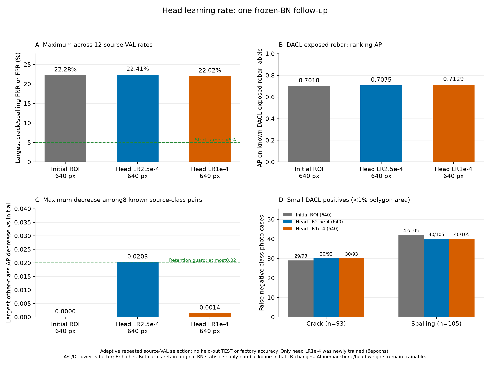

# 비backbone 초기 학습률 감소 후속 실험 결과

이전 frozen-BN의 반복 source-VAL 결과를 확인한 뒤, 비backbone 초기 학습률만 줄이는 후보 하나를 선택했다. 이번 head LR1e-4 후보만 원래0773에서 새로6epoch 학습하고, 완료된 frozen-BN head LR2.5e-4 대조6epoch를 그대로 재사용했다. 새 대조 학습은0epoch이며 이전6epoch를 새 비용에 더하지 않았다.
head 그룹은 기존 optimizer의 모든 비backbone student 파라미터다. 초기 LR만0.00025→0.0001로 낮추고 backbone LR0.00004, AdamW weight decay0.0002, CosineAnnealingLR T_max6·eta_min0.000005를 유지했다. 초기 head 비율은0.4지만 공통 최소값 때문에 전체 곡선이0.4배가 되는 실험은 아니다.
두 군 모두 BatchNorm47개의 원래 running 통계·141개 버퍼를 유지한다. 학습 정규화 정책은 같고 γ/β94개 affine, backbone·head 가중치가 계속 학습 가능하다. teacher weight4/T2, 원래 주석·추출 배열·640 입력·80×80 마스크·증강 난수·기본 손실 가중치를 유지했다.
원래 알려진 다른5종에 frozen0773 teacher의 Bernoulli KL을 적용하고 균열·박락·미확인 출처 항목은 증류 손실에서 제외했다. teacher 예측은 정규화 신호이며 새 정답이 아니다. 이전 관찰은 후보 선택의 이유이며 낮은 LR이 오류 원인이나 개선을 보장한다는 증거가 아니다.

| 모델 | 이번 새 epoch | 실제 epoch | 선택 epoch | 최대 검증 미탐·오탐 | 엄격한5% 기준 |
|---|---:|---:|---:|---:|---|
| 추가 학습 전 ROI 모델 | 0 | 6 | 6 | 22.28% | 미달 |
| 재사용 head LR2.5e-4 대조군 | 0 | 6 | 4 | 22.41% | 미달 |
| 후속 head LR1e-4 보강군 | 6 | 6 | 6 | 22.02% | 미달 |

head1e-4−초기 최대 오류 -0.26pp, head1e-4−재사용 head2.5e-4 대조 -0.39pp. 양수는 악화다.
최대값은 균열·박락 × DACL710/Dam424/CODEBRIM611 × FNR/FPR의12개 비율 중 최대이며 전체 사진 오답 비율·앱 정확도가 아니다.

## 변경한 학습률과 실제 관측

| scheduler step | 대조 head LR(기존 소스로 재구성) | 새 head LR(실제 관측) | 동일 backbone LR |
|---:|---:|---:|---:|
| 0 | 0.00025 | 0.0001 | 4e-05 |
| 1 | 0.000233588112 | 9.36362067e-05 | 3.76554446e-05 |
| 2 | 0.00018875 | 7.625e-05 | 3.125e-05 |
| 3 | 0.0001275 | 5.25e-05 | 2.25e-05 |
| 4 | 6.625e-05 | 2.875e-05 | 1.375e-05 |
| 5 | 2.1411888e-05 | 1.13637933e-05 | 7.34455543e-06 |
| 6 | 5e-06 | 5e-06 | 5e-06 |

step0~5의 새 LR은 각 epoch 시작 전 실제 optimizer에서 읽었고 step6은 마지막 scheduler.step 후 실제 그룹 LR이다. 기존 대조 RAW history에 LR 관측값이 없으므로 대조 곡선은 보존된 프로토콜·metadata·scheduler 소스로 계산했으며 과거 실제 관측으로 표시하지 않았다. 두 곡선은 마지막에 동일 floor5e-6에 도달한다.

## 유지 기준과 AP

고정 유지 후보 기준: **미달**. 다른 알려진 항목별 AP 하락이 초기 대비0.02 이하, DACL 철근 노출 AP 회복이 이번 frozen-BN head2.5e-4 대조 대비0.02 이상, 최대 균열·박락 오류 악화가 초기·이번 대조 각각 대비2pp 이하여야 한다. 이번 대조가 이미 높은 AP여도 회복 기준을 제외하거나 완화하지 않았다.

| 출처 | 다른 항목 | 초기 AP | head2.5e-4 AP | head1e-4 AP | 새−초기 | 새−대조 |
|---|---|---:|---:|---:|---:|---:|
| dacl | 녹 흔적 | 0.8771 | 0.8828 | 0.8820 | +0.0049 | -0.0007 |
| dacl | 철근 노출 | 0.7010 | 0.7075 | 0.7129 | +0.0119 | +0.0054 |
| dacl | 젖은 표면 | 0.5127 | 0.5216 | 0.5205 | +0.0078 | -0.0011 |
| dacl | 백화 | 0.7545 | 0.7580 | 0.7601 | +0.0056 | +0.0021 |
| dacl | 공동 | 0.6045 | 0.5842 | 0.6030 | -0.0014 | +0.0189 |
| codebrim | 녹 흔적 | 0.8769 | 0.8955 | 0.8940 | +0.0171 | -0.0016 |
| codebrim | 철근 노출 | 0.9660 | 0.9633 | 0.9691 | +0.0030 | +0.0058 |
| codebrim | 백화 | 0.8298 | 0.8436 | 0.8486 | +0.0188 | +0.0050 |

DACL 철근 노출 AP: 초기 **0.7010**, 재사용 head2.5e-4 **0.7075**, 새 head1e-4 **0.7129**. 새−대조 회복 +0.0054.
AP는 확률 순위 지표이며 정답률·오탐률이 아니다. 다른5종 알려진 조합8개×3모델=24개 AP, 전체7종 알려진 조합14개×3모델=42개 AP를 동일 정답·양성 분모에서 확인했다. 미확인 항목에0점 AP·정상 정답을 만들지 않았다.

## 기존 연구 기준과 작은 손상

기존 연구 후보 기준: **미달**. 초기0773·이번 head2.5e-4 대조 각각 대비 최대 오류0.5pp 이상 개선, 각 target 오류 악화2pp 이하, 다른 알려진 AP 하락0.02 이하, 작은 FN합계2건 이상 감소·항목별 FNR 악화2pp 이하를 그대로 요구했다. 유지·연구·엄격한5%는 독립 기준이다.

| 작은 손상 | 초기 FN/양성 | head2.5e-4 FN/양성 | head1e-4 FN/양성 |
|---|---:|---:|---:|
| 균열 | 29/93 | 30/93 | 30/93 |
| 박락 | 42/105 | 40/105 | 40/105 |

분모는 균열93·박락105의198개 항목·사진 사례다. 동일 사진이 두 항목에 들어갈 수 있어 고유 사진198장·물리적 손상 크기로 설명하지 않는다.

## 출처별 관측 오류

Wilson95% 구간은 고정 예측·독립 사진 가정의 기술 통계다. 반복 VAL epoch·임계값·후속 LR 선택을 보정한 현장 보장·모델 간 유의성 검정이 아니다.

| 모델 | 출처 | 항목 | FN/양성 | 미탐률 | FP/음성 | 오탐률 |
|---|---|---|---:|---:|---:|---:|
| 추가 학습 전 ROI 모델 | dacl | 균열 | 47/211 | 22.27% | 110/499 | 22.04% |
| 추가 학습 전 ROI 모델 | damsegment | 균열 | 2/248 | 0.81% | 1/176 | 0.57% |
| 추가 학습 전 ROI 모델 | codebrim | 균열 | 11/149 | 7.38% | 58/462 | 12.55% |
| 추가 학습 전 ROI 모델 | dacl | 박락 | 72/324 | 22.22% | 86/386 | 22.28% |
| 추가 학습 전 ROI 모델 | damsegment | 박락 | 11/58 | 18.97% | 8/366 | 2.19% |
| 추가 학습 전 ROI 모델 | codebrim | 박락 | 15/140 | 10.71% | 42/471 | 8.92% |
| 재사용 head LR2.5e-4 대조군 | dacl | 균열 | 44/211 | 20.85% | 105/499 | 21.04% |
| 재사용 head LR2.5e-4 대조군 | damsegment | 균열 | 2/248 | 0.81% | 3/176 | 1.70% |
| 재사용 head LR2.5e-4 대조군 | codebrim | 균열 | 11/149 | 7.38% | 53/462 | 11.47% |
| 재사용 head LR2.5e-4 대조군 | dacl | 박락 | 72/324 | 22.22% | 83/386 | 21.50% |
| 재사용 head LR2.5e-4 대조군 | damsegment | 박락 | 13/58 | 22.41% | 5/366 | 1.37% |
| 재사용 head LR2.5e-4 대조군 | codebrim | 박락 | 17/140 | 12.14% | 40/471 | 8.49% |
| 후속 head LR1e-4 보강군 | dacl | 균열 | 45/211 | 21.33% | 107/499 | 21.44% |
| 후속 head LR1e-4 보강군 | damsegment | 균열 | 2/248 | 0.81% | 1/176 | 0.57% |
| 후속 head LR1e-4 보강군 | codebrim | 균열 | 9/149 | 6.04% | 60/462 | 12.99% |
| 후속 head LR1e-4 보강군 | dacl | 박락 | 69/324 | 21.30% | 85/386 | 22.02% |
| 후속 head LR1e-4 보강군 | damsegment | 박락 | 12/58 | 20.69% | 6/366 | 1.64% |
| 후속 head LR1e-4 보강군 | codebrim | 박락 | 17/140 | 12.14% | 37/471 | 7.86% |

## 이번 비용과 보존

이번 새 학습6epoch·대조군 재학습0epoch다. 학습·epoch 검증 16.11분, allocated peak 2.079GiB, 실제 update 10679, AMP skip 7회를 기록했다.
학습 전 commit의 97개 소스, 실제 코드 테스트 24개와 새·재사용 가중치 CPU 재로딩·finite7/80/19 계약을 확인했다. 테스트 수는 정확도 사례 수가 아니다. 원래 TRAIN 입력 SHA·size·mtime, 모든7종 draw 노출·손실 가중치, teacher state·gradient 부재 및 두 군의 원래 BN141 버퍼를 유지했다.
새 LR은 실제 optimizer 관측으로 고정 곡선과 비교했다. 각 epoch 마지막 minibatch의 BN affine94개 gradient 존재·유한성·일부 nonzero를 확인했으며 모든 minibatch의 gradient나 모든 실제 update를 검증했다는 뜻은 아니다. AP loader·캐시 검증 뒤 정확한 정수값 float 양성 개수만 int로 표시하며 원래 점수·정답·AP·임계값은 그대로 유지했다.

## 적용 상태와 범위

보류 TEST 추론·자동 배포·앱 모델 승격은 하지 않았다. 기본 facility-validation-v2와 프로필 SHA를 유지했다. 새 독립 사진·라벨 변경·전문가 확정 라벨·새 사진/픽셀 정답은0개다.
한 seed, 공개 교량·댐 콘크리트, 반복 source-VAL에 따른 LR 선택과 사진 존재 분류 연구다. 공장 사진·정밀 위치·구조 안전·미래 현장 오차는 측정하지 않았다. 독립 평가·현장5% 미만 보장으로 설명하지 않으며 최종 판단은 점검자가 한다.

[고정 LR 정책](facility-head-lr-study-protocol.json), [실측 집계](facility-head-lr-study-comparison.json), [기술 검증](facility-head-lr-study-verification.json), [재사용 frozen-BN 결과](FACILITY_BATCHNORM_STUDY_RESULTS_KO.md)
