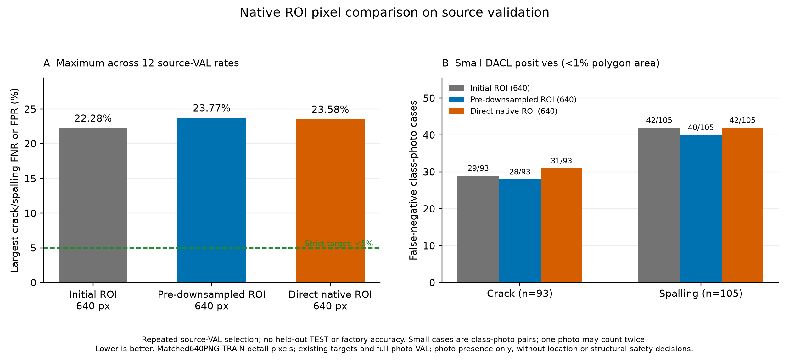

# 원본 세부 ROI 정보 보강 대조 실험 결과

같은 0773 초기 가중치에서 processed 대조군과 native 보강군을 각 6epoch, 총 12epoch 실제 학습했다. 두 군 모두 기존 AUX 구조·640 입력·80×80 마스크·top32·7종 출력·19종 보조 태그를 유지한다.
같은 EXIF 보정 native RGB를 사용한다. 대조군은 기존 processed 부모 크기로 LANCZOS 축소한 다음 원래 crop box를 읽고, 보강군은 같은 영역의 반열린 floating native box를 직접 읽는다. 둘 다 동일한 640×640 PNG로 저장하며 새 JPEG 압축은 넣지 않았다.
두 신규 군의 640 PNG는 과거 최대512 JPEG crop과 다르다. 새 대조군은 역사적 JPEG 픽셀 재현이 아니며, 초기 모델 비교에는 이 전처리 차이와 추가 학습이 함께 포함된다. native 정보 효과의 직접 대조는 새 대조군과 보강군 사이에서 해석한다.

기하 조건만으로 기존 DACL TRAIN 부모 3,521개의 세부 crop 5,928행을 선택했다. 양성·음성·미확인 crop을 모두 유지했고 실제 PNG 11,856개를 검증했다. full 행·다른 출처·정답·마스크·행 순서·추출 가중치는 보존한다. crop의 19종 보조 태그는 계속 미확인이다.

| 모델 | 입력 | 실제 epoch | 선택 epoch | 최대 검증 미탐·오탐 | 엄격한 5% 기준 |
|---|---:|---:|---:|---:|---|
| 추가 학습 전 ROI 모델 | 640 | 6 | 6 | 22.28% | 미달 |
| processed640 PNG 대조군 | 640 | 6 | 3 | 23.77% | 미달 |
| native640 PNG 보강군 | 640 | 6 | 6 | 23.58% | 미달 |

보강군−초기 모델 최대 오류 +1.30pp, 보강군−새 대조군 -0.19pp. 양수는 악화다.
최대값은 균열·박락 × DACL710/Dam424/CODEBRIM611 × FNR/FPR의 12개 비율 중 최대다. 전체 사진 오답 비율이나 앱 정확도가 아니다.

## 사전 선언한 연구 후보 기준

연구 후보 기준: **미달**. 초기 모델과 새 대조군 각각 대비 최대 오류 최소0.5pp 개선, 각 target 비율 악화2pp 이하, 다른 알려진 항목 AP 하락0.02 이하를 요구했다.
작은 DACL 항목·사진 양성 사례의 FN 합계도 각각 최소2건 줄고 항목별 FNR 악화가2pp 이하여야 한다. 이는 연구 후보 조건이며 엄격한5%·현장 검증·배포 승인과 별도다.

| 작은 손상 | 초기 FN/양성 | 새 대조 FN/양성 | native FN/양성 |
|---|---:|---:|---:|
| 균열 | 29/93 | 28/93 | 31/93 |
| 박락 | 42/105 | 40/105 | 42/105 |

분모는 균열93·박락105로 고정된 198개 항목·사진 사례다. 같은 사진이 두 항목에 들어갈 수 있으며 고유 사진198장이나 물리적 크기 정답을 뜻하지 않는다.

## 출처별 관측 오류와 기술 통계

Wilson 양측95%는 고정 예측과 독립 사진 가정의 기술 통계다. 같은 VAL에서 반복한 epoch·임계값 선택과 같은 부모의 파생 crop 상관 때문에 확인적 현장 보장이나 모델 간 유의성 검정으로 해석하지 않는다.

| 모델 | 출처 | 항목 | FN/양성 | 미탐률 | Wilson95 | FP/음성 | 오탐률 | Wilson95 |
|---|---|---|---:|---:|---|---:|---:|---|
| 추가 학습 전 ROI 모델 | dacl | 균열 | 47/211 | 22.27% | 17.18%–28.36% | 110/499 | 22.04% | 18.63%–25.89% |
| 추가 학습 전 ROI 모델 | damsegment | 균열 | 2/248 | 0.81% | 0.22%–2.89% | 1/176 | 0.57% | 0.10%–3.15% |
| 추가 학습 전 ROI 모델 | codebrim | 균열 | 11/149 | 7.38% | 4.17%–12.74% | 58/462 | 12.55% | 9.84%–15.89% |
| 추가 학습 전 ROI 모델 | dacl | 박락 | 72/324 | 22.22% | 18.04%–27.06% | 86/386 | 22.28% | 18.41%–26.69% |
| 추가 학습 전 ROI 모델 | damsegment | 박락 | 11/58 | 18.97% | 10.93%–30.85% | 8/366 | 2.19% | 1.11%–4.25% |
| 추가 학습 전 ROI 모델 | codebrim | 박락 | 15/140 | 10.71% | 6.60%–16.93% | 42/471 | 8.92% | 6.66%–11.83% |
| processed640 PNG 대조군 | dacl | 균열 | 45/211 | 21.33% | 16.34%–27.34% | 99/499 | 19.84% | 16.58%–23.56% |
| processed640 PNG 대조군 | damsegment | 균열 | 5/248 | 2.02% | 0.86%–4.63% | 1/176 | 0.57% | 0.10%–3.15% |
| processed640 PNG 대조군 | codebrim | 균열 | 10/149 | 6.71% | 3.69%–11.91% | 64/462 | 13.85% | 11.00%–17.30% |
| processed640 PNG 대조군 | dacl | 박락 | 77/324 | 23.77% | 19.46%–28.69% | 89/386 | 23.06% | 19.13%–27.51% |
| processed640 PNG 대조군 | damsegment | 박락 | 11/58 | 18.97% | 10.93%–30.85% | 9/366 | 2.46% | 1.30%–4.61% |
| processed640 PNG 대조군 | codebrim | 박락 | 17/140 | 12.14% | 7.72%–18.59% | 53/471 | 11.25% | 8.71%–14.43% |
| native640 PNG 보강군 | dacl | 균열 | 45/211 | 21.33% | 16.34%–27.34% | 106/499 | 21.24% | 17.88%–25.04% |
| native640 PNG 보강군 | damsegment | 균열 | 3/248 | 1.21% | 0.41%–3.50% | 1/176 | 0.57% | 0.10%–3.15% |
| native640 PNG 보강군 | codebrim | 균열 | 9/149 | 6.04% | 3.21%–11.08% | 58/462 | 12.55% | 9.84%–15.89% |
| native640 PNG 보강군 | dacl | 박락 | 76/324 | 23.46% | 19.17%–28.37% | 91/386 | 23.58% | 19.61%–28.06% |
| native640 PNG 보강군 | damsegment | 박락 | 9/58 | 15.52% | 8.38%–26.93% | 8/366 | 2.19% | 1.11%–4.25% |
| native640 PNG 보강군 | codebrim | 박락 | 12/140 | 8.57% | 4.97%–14.38% | 53/471 | 11.25% | 8.71%–14.43% |

AP는 확률 순위 지표다. 세 모델의 알려진 출처·항목 AP42개(DACL7/Dam2/CODEBRIM5)를 원래 VAL 캐시로 재계산하고 동일 정답·양성 분모를 확인했다. 미확인 항목에0점 AP를 만들지 않는다.

## 자원·보존·재현 확인

| 모델 | 학습·epoch 검증 시간 | allocated peak | 실제 update | AMP skip |
|---|---:|---:|---:|---:|
| processed640 PNG 대조군 | 24.65분 | 1.872 GiB | 10681 | 5 |
| native640 PNG 보강군 | 25.01분 | 1.872 GiB | 10681 | 5 |

새 쌍의 완료 학습은 12epoch다. 자료 준비·preflight의 버려지는 AMP2회·검증 CPU forward는 완료 학습 epoch에 더하지 않는다. 다른 실험과 실행 중단의 완료 epoch는 누적 보고에서 별도 집계한다.
실제6개 epoch의 추출 행 순서 SHA·출처·full/crop·target 조합 수를 대조했다. preflight에서는 실제 TRAIN8행의 같은 난수 증강으로 라벨·마스크·known·보조 태그·행 순서를 확인하고 군별 AMP1회와 CPU 재로딩을 실행했다. 이미지 tensor 자체는 바뀐 crop에서 같을 필요가 없다.
학습 전 commit의 30개 소스 바이트와 실제 30개 코드 테스트 통과를 확인했다. 실제 완료 가중치 두 개는 원래 TRAIN 사진으로 CPU 재로딩·finite7/80/19 출력 계약을 확인했다. 코드 테스트 수는 정확도 평가 수가 아니다.
모든 기록된 원본 TRAIN 입력의 SHA·size·mtime와 생성 PNG·재사용 마스크 바이트를 검사했다. 기하학적으로 같은 ROI라도 coarse80 격자의 원래 주석 오차는 남으며 새 native 정밀 위치 정답으로 바꾸지 않았다. 시간에는 자료 읽기·epoch 검증·캐시 영향이 포함되며 동일 epoch가 동일 시간·모바일 비용을 뜻하지 않는다.

## 적용 상태와 범위

보류 TEST 추론은 실행하지 않았다. 앱 기본 `facility-validation-v2`와 프로필 SHA를 유지하고 자동 배포·승격을 하지 않았다. 전문가 확정 라벨·원본 정답 변경·새 독립 사진은0개다.
기존 공개 교량·댐 콘크리트 자료의 한 seed 반복 VAL 연구다. TRAIN 세부 crop만 native 정보로 보강하며 VAL은 계속 원래 processed full 사진640 입력이다. native full 현장 입력·공장 사진·시설 정상/안전 판정·정밀 검출 성능은 측정하지 않았다.
원본이 작으면 새 세부 정보를 만들 수 없다. DACL19종 원본 주석은 이미 사용하던 보조 태그이며 새 자료 수집이 아니다. DamSegment Non-Crack의 기존 항목별 음성 변환과 미확인 태그 범위는 [정답 범위](FACILITY_LABEL_SCOPE_KO.md)에 따른다.
반복 검증 결과로 미래 현장의 오차율5% 미만을 보장하지 않는다. 검출 없음으로 구조 안전이나 법적 점검 완료를 확정하지 않으며 최종 판단은 점검자가 한다. 공개 보고에는 개별 사진·주석·box·검수 내용·개인 절대 경로를 넣지 않았다.

[사전 조건](facility-native-roi-study-protocol.json), [자료 보존 집계](facility-native-roi-data-audit.json), [실측 집계](facility-native-roi-study-comparison.json), [기술 검증](facility-native-roi-study-verification.json)

## 자료 준비 실측 비용

자료 준비 9.04분, workers 4, 생성 PNG 총 5.440 GiB를 기록했다. 대조 부모 축소는 부모별 캐시로 3,521회 실행했다.
PNG 크기는 실제 압축 파일 합계다. 원본 자료·NPZ 마스크·모델·중간 캐시를 포함하는 전체 디스크 용량이 아니며, 준비 시간은 GPU 학습 시간과 따로 집계했다.

## 학습 완료 후 보고 표현형 보정

동결 reporter의 최초 보고 실행은 AP 양성 분모가 `211.0` 같은 정수값 float로 저장되어 새 정수 타입 검사에서 중단됐다. 해당 실패 기록의 SHA를 보존했다. 학습 소스30개·기존 테스트3개·프로토콜·정답·확률·가중치를 변경하지 않았다.

별도 보고 adapter가 원래 loader의 검증을 먼저 실행하고, `ranking_ap.positive_photos`에서 유한·비음수·정확한 정수값 float만 원래 known 분모 이내에서 int로 바꿨다. 미탐·오탐·AP·임계값·후보 기준 계산과 원래 frozen main은 그대로 실행했다. bool·NaN·소수·음수는 허용하지 않는다. 이 수정은 새 학습·정답 수정·성능 개선이 아니다.

추가 adapter 테스트 4개가 실제 통과했다. 원래 학습 전30개 테스트와 별도이며 정확도 평가 사례 수가 아니다. JSON의 `reporting_provenance`에 adapter·테스트·실패 증거 SHA와 메타데이터 추가 전후 동일한 계측 payload SHA를 기록했다.

실행 명령: `python scripts/report_facility_native_roi_results.py`

[추가 adapter 테스트 실측](facility-native-roi-report-adapter-tests.json)
