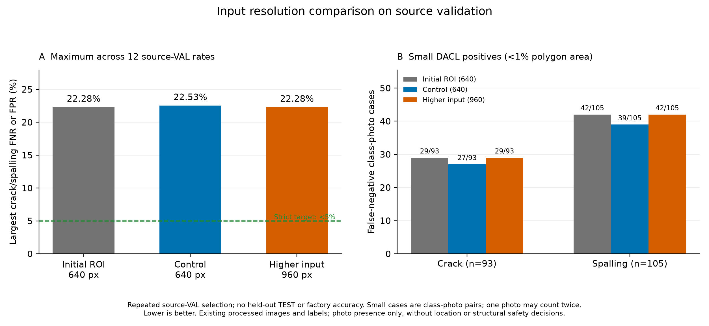

# 640·960 입력 해상도 대조 학습 결과

## 결과 요약

960 보강군의 최대 검증 미탐·오탐은 22.28%로 초기 모델과 같았다. 작은 결함의 누락 합계도 초기 71건, 640 대조군 66건, 960 보강군 71건이었다. 이번 한 seed의 실험에서 해상도 확대의 개선 효과를 확인하지 못했으며, 사전 연구 후보 기준과 엄격한 5% 기준에 미달했다.

다음 연구에서는 TRAIN 사진의 세부 정보와 어려운 사례의 라벨 경계를 먼저 확인할 필요가 있다. 기존 processed 사진 확대와 native 원본의 상세 ROI 활용은 다른 실험이다. [TRAIN 원본 조사](facility-resolution-source-audit.json)에서 native 원본이 processed 사진보다 큰 사례가 3,521/6,225건이었지만, 이 사실만으로 성능 향상을 예측할 수는 없다. 후속 학습의 조건·비교 기준을 정하고 별도로 평가해야 한다.

## 실험 조건과 관측값

같은 초기 ROI 모델에서 각 6epoch, 총 12epoch를 실제 추가 학습했다. 원본 정답·자료·표본 순서·손실을 유지하고 입력 해상도를 비교했다.
960의 원시 120×120 logit은 area 평균으로 80×80에 맞춘 뒤 기존 top32·사진/지도 혼합에 사용했다. 픽셀 손실도 기존 80×80 주석을 사용한다. 새 파라미터·정밀 위치 정답·현장 사진은 추가하지 않았다.

| 모델 | 입력 | 실제 epoch | 선택 epoch | 최대 검증 미탐·오탐 | 엄격한 5% 기준 |
|---|---:|---:|---:|---:|---|
| 추가 학습 전 ROI 모델 | 640 | 6 | 6 | 22.28% | 미달 |
| 640 대조군 | 640 | 6 | 3 | 22.53% | 미달 |
| 960 보강군 | 960 | 6 | 5 | 22.28% | 미달 |

별도 실행 중단에서 완료 2epoch·optimizer update 3560회를 기록하고 보존했다. optimizer 복원 파일이 없어 같은 조건의 초기 가중치로 대조군을 다시 시작했다. 이 중단 기록은 위 모델 비교에 넣지 않았다.
이번 실험의 기록된 완료 학습 총량은 대조·보강 쌍 12epoch와 중단 기록을 합친 14epoch다. 중단 당시 진행 중이던 부분 epoch 작업량은 정량 기록이 없어 이 수에 포함하지 않았다. 조건·예산·정답은 바꾸지 않았다.

보강군−초기 모델 최대 오류 +0.00pp, 보강군−대조군 -0.25pp. 양수는 악화다.
최대값은 균열·박락 × 세 출처 × FNR/FPR의 12개 비율 중 최대다. 전체 오답 사진 비율이나 앱 정확도가 아니다.

## 사전 선언한 연구 후보 기준

연구 후보 기준: **미달**. 초기 모델과 대조군 각각 대비 최대 오류 0.5pp 개선, 항목별 오류 악화 2pp 이하, 다른 알려진 항목 AP 악화 0.02 이하를 요구했다.
작은 DACL 양성 198개 항목·사진 사례의 FN 합계도 각각 최소 2건 줄고 항목별 FNR 악화가 2pp 이하여야 한다. 한 사진이 두 항목에 포함될 수 있다. 연구 기준 통과는 엄격한 5% 기준·현장 검증·앱 배포 통과와 별도다.

| 항목 | 초기 FN/양성 | 대조 FN/양성 | 보강 FN/양성 |
|---|---:|---:|---:|
| 균열 | 29/93 | 27/93 | 29/93 |
| 박락 | 42/105 | 39/105 | 42/105 |

## 출처별 관측 오류

Wilson95는 고정 예측·독립 사진 가정의 기술 통계다. 반복 VAL 선택·같은 원본의 파생 crop 상관 때문에 현장 보장이나 모델 차이 유의성 검정이 아니다.

| 모델 | 자료 | 항목 | FN/양성 | 미탐률 | Wilson95 | FP/음성 | 오탐률 | Wilson95 |
|---|---|---|---:|---:|---|---:|---:|---|
| 추가 학습 전 ROI 모델 | dacl | 균열 | 47/211 | 22.27% | 17.18%–28.36% | 110/499 | 22.04% | 18.63%–25.89% |
| 추가 학습 전 ROI 모델 | damsegment | 균열 | 2/248 | 0.81% | 0.22%–2.89% | 1/176 | 0.57% | 0.10%–3.15% |
| 추가 학습 전 ROI 모델 | codebrim | 균열 | 11/149 | 7.38% | 4.17%–12.74% | 58/462 | 12.55% | 9.84%–15.89% |
| 추가 학습 전 ROI 모델 | dacl | 박락 | 72/324 | 22.22% | 18.04%–27.06% | 86/386 | 22.28% | 18.41%–26.69% |
| 추가 학습 전 ROI 모델 | damsegment | 박락 | 11/58 | 18.97% | 10.93%–30.85% | 8/366 | 2.19% | 1.11%–4.25% |
| 추가 학습 전 ROI 모델 | codebrim | 박락 | 15/140 | 10.71% | 6.60%–16.93% | 42/471 | 8.92% | 6.66%–11.83% |
| 640 대조군 | dacl | 균열 | 45/211 | 21.33% | 16.34%–27.34% | 97/499 | 19.44% | 16.21%–23.14% |
| 640 대조군 | damsegment | 균열 | 5/248 | 2.02% | 0.86%–4.63% | 0/176 | 0.00% | 0.00%–2.14% |
| 640 대조군 | codebrim | 균열 | 9/149 | 6.04% | 3.21%–11.08% | 64/462 | 13.85% | 11.00%–17.30% |
| 640 대조군 | dacl | 박락 | 73/324 | 22.53% | 18.32%–27.39% | 86/386 | 22.28% | 18.41%–26.69% |
| 640 대조군 | damsegment | 박락 | 11/58 | 18.97% | 10.93%–30.85% | 8/366 | 2.19% | 1.11%–4.25% |
| 640 대조군 | codebrim | 박락 | 18/140 | 12.86% | 8.29%–19.41% | 53/471 | 11.25% | 8.71%–14.43% |
| 960 보강군 | dacl | 균열 | 42/211 | 19.91% | 15.08%–25.81% | 99/499 | 19.84% | 16.58%–23.56% |
| 960 보강군 | damsegment | 균열 | 3/248 | 1.21% | 0.41%–3.50% | 2/176 | 1.14% | 0.31%–4.05% |
| 960 보강군 | codebrim | 균열 | 6/149 | 4.03% | 1.86%–8.51% | 53/462 | 11.47% | 8.88%–14.70% |
| 960 보강군 | dacl | 박락 | 72/324 | 22.22% | 18.04%–27.06% | 86/386 | 22.28% | 18.41%–26.69% |
| 960 보강군 | damsegment | 박락 | 11/58 | 18.97% | 10.93%–30.85% | 16/366 | 4.37% | 2.71%–6.98% |
| 960 보강군 | codebrim | 박락 | 13/140 | 9.29% | 5.51%–15.24% | 41/471 | 8.70% | 6.48%–11.60% |

## 자원·재현 확인

| 모델 | 학습·epoch 검증 시간 | allocated peak | 실제 update | AMP skip |
|---|---:|---:|---:|---:|
| 640 대조군 | 24.12분 | 1.872 GiB | 10681 | 5 |
| 960 보강군 | 40.81분 | 4.085 GiB | 10680 | 6 |

시간에는 자료 읽기·epoch 검증·캐시·병행 작업의 영향이 포함된다. 같은 epoch·표본 수는 같은 시간·메모리·모바일 추론 비용이 아니다.
여섯 epoch의 실제 row 순서 SHA·출처·full/crop·항목 조합 수를 비교했다. 이미지 해상도가 달라 입력 tensor는 같지 않으며, preflight의 세 batch만 라벨·마스크·known·행 순서 재현을 확인했다.

## 적용 상태와 한계

보류 TEST 추론은 실행하지 않았다. 앱 기본 `facility-validation-v2`와 프로필 SHA는 유지한다. 입력 사진 확대가 native 정보가 없는 작은 사진에 새 세부 정보를 만들지는 않는다.
기존 processed DACL 최대 변1280 사진을 사용했다. 더 큰 native 원본 입력·새 현장 자료·전문가 라벨 수정·이음매 별도 정답을 추가한 실험은 아니다. 원래 19종 보조 태그에는 이음매 관련 태그가 포함되며 이전부터 사용했다.
한 seed와 반복 사용한 공개 자료 VAL의 결과이며 공장 시설 성능은 미측정이다. 이번 결과로 구조 안전이나 법적 점검 완료를 확정하지 않는다.

[사전 계획](FACILITY_RESOLUTION_STUDY_PLAN_KO.md), [고정 조건](facility-resolution-study-protocol.json), [실측 집계](facility-resolution-study-comparison.json), [기술 검증](facility-resolution-study-verification.json)

완료 가중치 두 개를 CPU에서 실제 재로딩하고, 학습 전 commit의 18개 소스 바이트와 실제 38개 코드 테스트 통과를 확인했다. 코드 테스트 수는 성능 측정 수가 아니다.
학습 시작 전 metadata 경로 형식 오류가 한 번 있었으며 당시 optimizer update·완료 epoch는 0이었다. 해당 기록을 보존하고 한 줄 수정 후 조건과 소스를 다시 고정해 두 군을 처음부터 실행했다.
