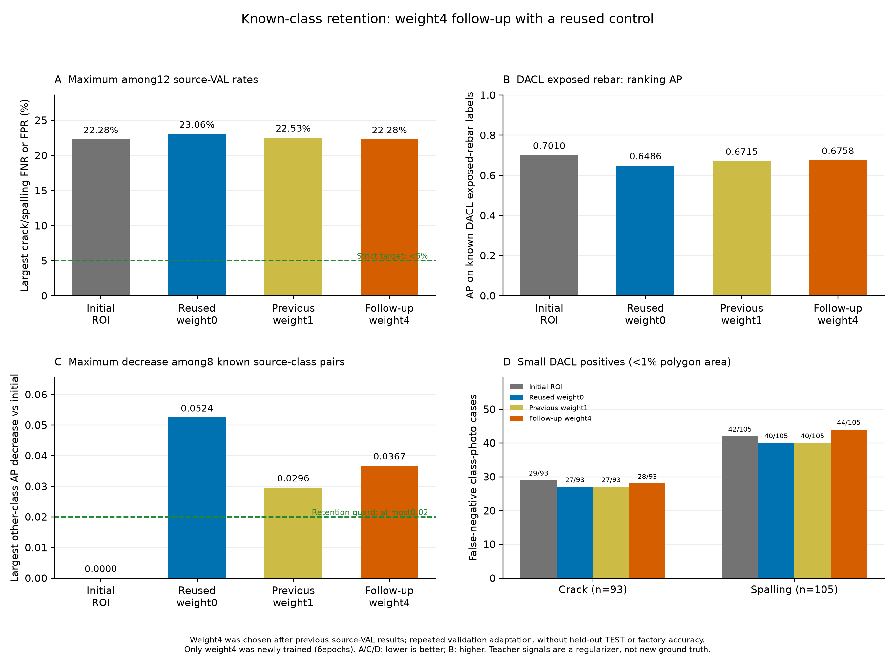

# 항목 유지 증류 강도4 후속 학습 결과

이전 weight1의 source-VAL 결과를 확인한 뒤, 동일 조건의 weight4 후보 하나를 선택했다. 이번 후보의 조건은 새 학습 전에 고정했지만 앞선 VAL에 따른 적응적 후속 실험이므로 독립 확인 실험은 아니다.
weight4만 원래0773 초기 모델에서 새로6epoch 학습했다. 완료된 weight0 대조군6epoch와 이전 weight1 6epoch는 그대로 재사용했다. 새 대조군을 재학습하거나 이전12epoch를 이번 비용에 다시 더하지 않았다.
원래 control 추출 배열·동일 증강 난수·원본 주석·640 입력·80×80 마스크·기존7종 출력·19종 보조 태그를 유지했다. 0773 eval·frozen teacher의 온도2 Bernoulli KL을 원래 알려진 다른5종에만 적용하며 weight만1→4로 바꿨다. 균열·박락과 미확인 출처 항목은 손실에서 제외했다. teacher 예측은 soft 정규화 신호이고 새 정답이 아니다.

| 모델 | 이번 새 epoch | 기존/이번 실제 epoch | 선택 epoch | 최대 검증 미탐·오탐 | 엄격한5% 기준 |
|---|---:|---:|---:|---:|---|
| 추가 학습 전 ROI 모델 | 0 | 6 | 6 | 22.28% | 미달 |
| 재사용 weight0 대조군 | 0 | 6 | 3 | 23.06% | 미달 |
| 이전 weight1 증류군 | 0 | 6 | 3 | 22.53% | 미달 |
| 후속 weight4 증류군 | 6 | 6 | 3 | 22.28% | 미달 |

weight4−초기 최대 오류 +0.00pp, weight4−재사용 대조 -0.78pp, weight4−이전 weight1 -0.25pp. 양수는 악화다.
최대값은 균열·박락 × DACL710/Dam424/CODEBRIM611 × FNR/FPR의12개 비율 중 최대다. 전체 사진 오답 비율이나 앱 정확도가 아니다.

## 원래 유지 기준과 다른 항목 AP

고정된 유지 후보 기준: **미달**. 다른 알려진 항목 각각의 AP 하락이 초기 대비0.02 이하, DACL 철근 노출 AP 회복이 재사용 weight0 대비0.02 이상, 최대 균열·박락 오류 악화가 초기·재사용 대조 각각 대비2pp 이하여야 한다. 기준을 완화하지 않았다.

| 출처 | 다른 항목 | 초기 AP | 대조0 AP | 이전1 AP | 후속4 AP | 4−1 AP |
|---|---|---:|---:|---:|---:|---:|
| dacl | 녹 흔적 | 0.8771 | 0.8771 | 0.8769 | 0.8757 | -0.0012 |
| dacl | 철근 노출 | 0.7010 | 0.6486 | 0.6715 | 0.6758 | +0.0043 |
| dacl | 젖은 표면 | 0.5127 | 0.5401 | 0.5369 | 0.5303 | -0.0066 |
| dacl | 백화 | 0.7545 | 0.7442 | 0.7504 | 0.7554 | +0.0050 |
| dacl | 공동 | 0.6045 | 0.5872 | 0.5845 | 0.5935 | +0.0091 |
| codebrim | 녹 흔적 | 0.8769 | 0.8636 | 0.8603 | 0.8626 | +0.0023 |
| codebrim | 철근 노출 | 0.9660 | 0.9626 | 0.9656 | 0.9696 | +0.0040 |
| codebrim | 백화 | 0.8298 | 0.8304 | 0.8061 | 0.7931 | -0.0130 |

DACL 철근 노출 AP: 초기 **0.7010**, 대조0 **0.6486**, 이전1 **0.6715**, 후속4 **0.6758**. 후속4−이전1 +0.0043; 후속4−대조0 +0.0272.

| 모델 | 다른 알려진 항목 최대 AP 하락(초기 대비) |
|---|---:|
| 추가 학습 전 ROI 모델 | 0.0000 |
| 재사용 weight0 대조군 | 0.0524 |
| 이전 weight1 증류군 | 0.0296 |
| 후속 weight4 증류군 | 0.0367 |

AP는 확률 순위 지표이며 정답률·오탐률이 아니다. 다른5종의 알려진 출처 조합은 DACL5·Dam0·CODEBRIM3=8개로 네 모델32개 AP를 비교했다. 전체7종의 알려진 조합은14개로 네 모델56개 AP를 확인했다. 미확인 항목에0점 AP·정상 정답을 만들지 않았다.

## 기존 연구 기준과 작은 손상

기존 연구 후보 기준: **미달**. 원래 초기0773·재사용 weight0 대조 각각 대비 최대 오류0.5pp 이상 개선, 각 target 오류 악화2pp 이하, 다른 알려진 AP 하락0.02 이하, 작은 사례 FN합계2건 이상 감소·항목별 FNR 악화2pp 이하를 그대로 계산했다.
이전 weight1과의 추가 차이는 기술 통계이며 새 승격 기준을 만들지 않았다. 유지 기준·기존 연구 기준·엄격한5% 통과를 서로 대체하지 않는다.

| 작은 손상 | 초기 FN/양성 | 대조0 FN/양성 | 이전1 FN/양성 | 후속4 FN/양성 |
|---|---:|---:|---:|---:|
| 균열 | 29/93 | 27/93 | 27/93 | 28/93 |
| 박락 | 42/105 | 40/105 | 40/105 | 44/105 |

분모는 균열93·박락105의198개 항목·사진 사례다. 같은 사진이 두 항목에 들어갈 수 있고 고유 사진198장·실제 손상 크기를 뜻하지 않는다.

## 출처별 관측 오류

Wilson95% 구간은 고정 예측·독립 사진 가정의 기술 통계다. 반복 사용한 VAL의 epoch·임계값 선택과 후속 강도 선택을 보정한 독립 현장 보장·모델 간 유의성 검정이 아니다.

| 모델 | 출처 | 항목 | FN/양성 | 미탐률 | FP/음성 | 오탐률 |
|---|---|---|---:|---:|---:|---:|
| 추가 학습 전 ROI 모델 | dacl | 균열 | 47/211 | 22.27% | 110/499 | 22.04% |
| 추가 학습 전 ROI 모델 | damsegment | 균열 | 2/248 | 0.81% | 1/176 | 0.57% |
| 추가 학습 전 ROI 모델 | codebrim | 균열 | 11/149 | 7.38% | 58/462 | 12.55% |
| 추가 학습 전 ROI 모델 | dacl | 박락 | 72/324 | 22.22% | 86/386 | 22.28% |
| 추가 학습 전 ROI 모델 | damsegment | 박락 | 11/58 | 18.97% | 8/366 | 2.19% |
| 추가 학습 전 ROI 모델 | codebrim | 박락 | 15/140 | 10.71% | 42/471 | 8.92% |
| 재사용 weight0 대조군 | dacl | 균열 | 44/211 | 20.85% | 106/499 | 21.24% |
| 재사용 weight0 대조군 | damsegment | 균열 | 5/248 | 2.02% | 1/176 | 0.57% |
| 재사용 weight0 대조군 | codebrim | 균열 | 10/149 | 6.71% | 66/462 | 14.29% |
| 재사용 weight0 대조군 | dacl | 박락 | 74/324 | 22.84% | 89/386 | 23.06% |
| 재사용 weight0 대조군 | damsegment | 박락 | 11/58 | 18.97% | 9/366 | 2.46% |
| 재사용 weight0 대조군 | codebrim | 박락 | 17/140 | 12.14% | 51/471 | 10.83% |
| 이전 weight1 증류군 | dacl | 균열 | 45/211 | 21.33% | 105/499 | 21.04% |
| 이전 weight1 증류군 | damsegment | 균열 | 5/248 | 2.02% | 0/176 | 0.00% |
| 이전 weight1 증류군 | codebrim | 균열 | 10/149 | 6.71% | 67/462 | 14.50% |
| 이전 weight1 증류군 | dacl | 박락 | 73/324 | 22.53% | 86/386 | 22.28% |
| 이전 weight1 증류군 | damsegment | 박락 | 11/58 | 18.97% | 8/366 | 2.19% |
| 이전 weight1 증류군 | codebrim | 박락 | 16/140 | 11.43% | 45/471 | 9.55% |
| 후속 weight4 증류군 | dacl | 균열 | 44/211 | 20.85% | 103/499 | 20.64% |
| 후속 weight4 증류군 | damsegment | 균열 | 6/248 | 2.42% | 0/176 | 0.00% |
| 후속 weight4 증류군 | codebrim | 균열 | 13/149 | 8.72% | 53/462 | 11.47% |
| 후속 weight4 증류군 | dacl | 박락 | 72/324 | 22.22% | 86/386 | 22.28% |
| 후속 weight4 증류군 | damsegment | 박락 | 10/58 | 17.24% | 9/366 | 2.46% |
| 후속 weight4 증류군 | codebrim | 박락 | 16/140 | 11.43% | 43/471 | 9.13% |

## 이번 실제 비용과 보존

새 weight4 학습·epoch 검증 19.02분, allocated peak 2.079GiB, 실제 update 10681, AMP skip 5, teacher forward 10686회다. 이번 새 완료 epoch는6, 새 대조군 학습은0이다.
학습 전 commit의 74개 소스와 실제 코드 테스트 28개를 확인했다. 테스트 수는 정확도 사례 수가 아니다. 새 가중치를 CPU에서 엄격하게 재로딩하고 finite7/80/19 계약을 검증했다.
원래 full TRAIN14,248·전체26,289행의 이미지·마스크·known·주석·auxiliary 태그·기본 추출 가중치·손실 양성 가중치를 유지했다. 재사용 대조·이전 증류 가중치·기존61개 소스 바이트와 teacher 초기/최종 state SHA·eval·gradient 부재를 보존했다. 양쪽 추출 순서와 모든7종 정답 노출은 같다.
원래 loader·캐시 검증 뒤 유한·비음수·known 분모 이내의 정확한 정수값 float AP 양성 개수만 int로 표시했다. bool·소수·NaN·무한대는 거부하며 점수·정답·AP·임계값·기존 기준을 바꾸지 않았다.

## 적용 상태와 한계

보류 TEST 추론·자동 배포·앱 모델 승격을 하지 않았다. 앱 기본 `facility-validation-v2`와 프로필 SHA를 유지했다. 새 독립 사진·원본 라벨 변경·전문가 확정 라벨·새 사진/픽셀 정답은0개다.
공개 교량·댐 콘크리트 자료, 한 seed, 반복 사용한 source-VAL의 사진 존재 분류 연구다. 공장 현장 사진·정밀 위치·구조 안전·미래 현장 오차율은 측정하지 않았다. 반복 VAL 적응 후 결과를 독립 평가나 현장5% 미만 보장으로 설명하지 않는다. 최종 안전 판단은 점검자가 한다.

[고정 후속 조건](facility-retention-strength-study-protocol.json), [실측 집계](facility-retention-strength-study-comparison.json), [기술 검증](facility-retention-strength-study-verification.json)
