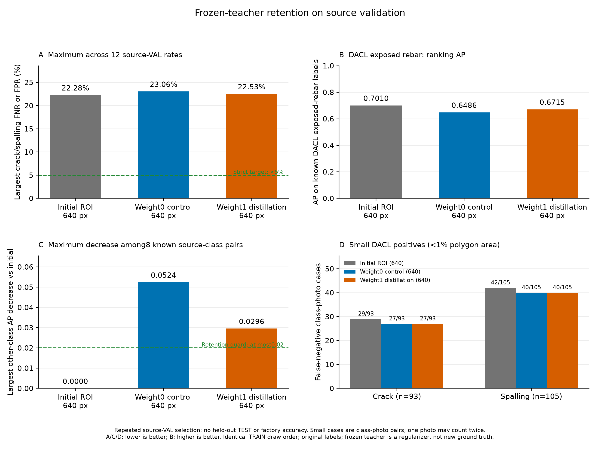

# 시설 항목 성능 유지 증류 대조 학습 결과

같은 0773 초기 가중치에서 대조군·증류군을 각각6epoch, 총12epoch 실제 추가 학습했다. 두 군 모두 원래 control 추출 배열·같은 증강 난수·640 입력·80×80 마스크·기존7종 출력·19종 보조 태그를 사용했다. 이전 하위유형 보강 추출 배열은 사용하지 않았다.
원래 0773 모델을 eval·파라미터 고정 상태의 teacher로 두고, TRAIN에서 원래 정답이 알려진 다른5종(녹 흔적·철근 노출·젖은 표면·백화·공동)에만 온도2 Bernoulli KL 정규화를 적용했다. 대조군 weight0·증류군 weight1이며 teacher forward는 양쪽 모두 수행했다. 균열·박락과 미확인 출처 항목은 증류 손실에서 제외했다.
teacher 예측은 원래 기능을 유지하도록 돕는 soft 정규화 신호다. 새 ground truth·전문가 판단·새 라벨로 취급하지 않았다. teacher forward 추가 비용은 실측 학습 시간에 포함되며 배포 학생 모델의 파라미터 수는 늘리지 않았다.

| 모델 | 실제 epoch | 선택 epoch | 최대 검증 미탐·오탐 | 엄격한 5% 기준 |
|---|---:|---:|---:|---|
| 추가 학습 전 ROI 모델 | 6 | 6 | 22.28% | 미달 |
| 증류 weight0 대조군 | 6 | 3 | 23.06% | 미달 |
| 항목 유지 증류 weight1 보강군 | 6 | 3 | 22.53% | 미달 |

증류군−초기 모델 최대 오류 +0.25pp, 증류군−새 대조군 -0.53pp. 양수는 악화다.
최대값은 균열·박락 × DACL710/Dam424/CODEBRIM611 × FNR/FPR의12개 비율 중 최대이며 전체 사진 오답 비율·앱 정확도가 아니다.

## 항목 유지 기준과 관측 AP

사전 선언한 유지 후보 기준: **미달**. 알려진 다른5종의 각 출처별 AP가 초기 모델보다0.02를 초과해 하락하지 않고, DACL 철근 노출 AP가 새 대조군보다0.02 이상 회복하며, 최대 균열·박락 오류가 초기 모델·새 대조군 각각보다2pp를 초과해 악화하지 않아야 한다.
이 기준은 기존 연구 후보 기준·엄격한5% 기준과 별도로 계산했다. AP는 확률 순위 지표이며 정답률·오탐률과 같은 지표가 아니다.

| 출처 | 다른 항목 | 초기 AP | 새 대조 AP | 증류 AP | 증류−초기 | 증류−대조 | 초기 대비 유지 |
|---|---|---:|---:|---:|---:|---:|---|
| dacl | 녹 흔적 | 0.8771 | 0.8771 | 0.8769 | -0.0002 | -0.0002 | 통과 |
| dacl | 철근 노출 | 0.7010 | 0.6486 | 0.6715 | -0.0296 | +0.0229 | 미달 |
| dacl | 젖은 표면 | 0.5127 | 0.5401 | 0.5369 | +0.0242 | -0.0031 | 통과 |
| dacl | 백화 | 0.7545 | 0.7442 | 0.7504 | -0.0041 | +0.0062 | 통과 |
| dacl | 공동 | 0.6045 | 0.5872 | 0.5845 | -0.0200 | -0.0027 | 통과 |
| codebrim | 녹 흔적 | 0.8769 | 0.8636 | 0.8603 | -0.0166 | -0.0033 | 통과 |
| codebrim | 철근 노출 | 0.9660 | 0.9626 | 0.9656 | -0.0005 | +0.0030 | 통과 |
| codebrim | 백화 | 0.8298 | 0.8304 | 0.8061 | -0.0237 | -0.0243 | 미달 |

DACL 철근 노출 AP: 초기 **0.7010**, 새 대조 **0.6486**, 증류 **0.6715**. 증류−새 대조 회복 +0.0229; 기준 통과.

| 모델 | 다른 알려진 항목의 최대 AP 하락(초기 대비) | 해당 출처·항목 |
|---|---:|---|
| 추가 학습 전 ROI 모델 | 0.0000 | dacl·녹 흔적 |
| 증류 weight0 대조군 | 0.0524 | dacl·철근 노출 |
| 항목 유지 증류 weight1 보강군 | 0.0296 | dacl·철근 노출 |

다른5종 중 알려진 출처 조합은 DACL5·Dam0·CODEBRIM3의8개이며3모델 총24개 AP를 비교했다. 전체7종의 알려진 AP는14조합×3모델=42개다. 미확인 항목에0점 AP나 정상 정답을 만들지 않았다. 대조군에도 추가 학습과 선택의 영향이 있으므로 이전 변화 전체를 하위유형 추출만의 원인으로 단정하지 않는다.

## 기존 연구 후보 기준과 작은 손상

기존 연구 후보 기준: **미달**. 초기 모델·새 대조군 각각 대비 최대 오류 최소0.5pp 개선, 각 target 오류 악화2pp 이하, 다른 알려진 항목 AP 하락0.02 이하 및 작은 사례 FN 합계 최소2건 감소·항목별 FNR 악화2pp 이하를 그대로 요구했다.

| 작은 손상 | 초기 FN/양성 | 새 대조 FN/양성 | 증류 FN/양성 |
|---|---:|---:|---:|
| 균열 | 29/93 | 27/93 | 27/93 |
| 박락 | 42/105 | 40/105 | 40/105 |

분모는 균열93·박락105의198개 항목·사진 사례다. 같은 사진이 두 항목에 들어갈 수 있으며 고유 사진198장·실제 물리적 크기를 뜻하지 않는다.

## 출처별 관측 오류

Wilson 양측95%는 고정 예측과 독립 사진 가정 아래 기술 통계다. 반복한 VAL epoch·임계값 선택과 파생 crop 상관을 보정한 현장 보장·모델 간 유의성 검정이 아니다.

| 모델 | 출처 | 항목 | FN/양성 | 미탐률 | Wilson95 | FP/음성 | 오탐률 | Wilson95 |
|---|---|---|---:|---:|---|---:|---:|---|
| 추가 학습 전 ROI 모델 | dacl | 균열 | 47/211 | 22.27% | 17.18%–28.36% | 110/499 | 22.04% | 18.63%–25.89% |
| 추가 학습 전 ROI 모델 | damsegment | 균열 | 2/248 | 0.81% | 0.22%–2.89% | 1/176 | 0.57% | 0.10%–3.15% |
| 추가 학습 전 ROI 모델 | codebrim | 균열 | 11/149 | 7.38% | 4.17%–12.74% | 58/462 | 12.55% | 9.84%–15.89% |
| 추가 학습 전 ROI 모델 | dacl | 박락 | 72/324 | 22.22% | 18.04%–27.06% | 86/386 | 22.28% | 18.41%–26.69% |
| 추가 학습 전 ROI 모델 | damsegment | 박락 | 11/58 | 18.97% | 10.93%–30.85% | 8/366 | 2.19% | 1.11%–4.25% |
| 추가 학습 전 ROI 모델 | codebrim | 박락 | 15/140 | 10.71% | 6.60%–16.93% | 42/471 | 8.92% | 6.66%–11.83% |
| 증류 weight0 대조군 | dacl | 균열 | 44/211 | 20.85% | 15.92%–26.83% | 106/499 | 21.24% | 17.88%–25.04% |
| 증류 weight0 대조군 | damsegment | 균열 | 5/248 | 2.02% | 0.86%–4.63% | 1/176 | 0.57% | 0.10%–3.15% |
| 증류 weight0 대조군 | codebrim | 균열 | 10/149 | 6.71% | 3.69%–11.91% | 66/462 | 14.29% | 11.39%–17.77% |
| 증류 weight0 대조군 | dacl | 박락 | 74/324 | 22.84% | 18.60%–27.71% | 89/386 | 23.06% | 19.13%–27.51% |
| 증류 weight0 대조군 | damsegment | 박락 | 11/58 | 18.97% | 10.93%–30.85% | 9/366 | 2.46% | 1.30%–4.61% |
| 증류 weight0 대조군 | codebrim | 박락 | 17/140 | 12.14% | 7.72%–18.59% | 51/471 | 10.83% | 8.33%–13.96% |
| 항목 유지 증류 weight1 보강군 | dacl | 균열 | 45/211 | 21.33% | 16.34%–27.34% | 105/499 | 21.04% | 17.69%–24.83% |
| 항목 유지 증류 weight1 보강군 | damsegment | 균열 | 5/248 | 2.02% | 0.86%–4.63% | 0/176 | 0.00% | 0.00%–2.14% |
| 항목 유지 증류 weight1 보강군 | codebrim | 균열 | 10/149 | 6.71% | 3.69%–11.91% | 67/462 | 14.50% | 11.58%–18.01% |
| 항목 유지 증류 weight1 보강군 | dacl | 박락 | 73/324 | 22.53% | 18.32%–27.39% | 86/386 | 22.28% | 18.41%–26.69% |
| 항목 유지 증류 weight1 보강군 | damsegment | 박락 | 11/58 | 18.97% | 10.93%–30.85% | 8/366 | 2.19% | 1.11%–4.25% |
| 항목 유지 증류 weight1 보강군 | codebrim | 박락 | 16/140 | 11.43% | 7.16%–17.76% | 45/471 | 9.55% | 7.22%–12.55% |

## 실제 자원·자료·teacher 보존

| 모델 | 학습·epoch 검증 시간 | allocated peak | 실제 update | AMP skip | teacher forward |
|---|---:|---:|---:|---:|---:|
| 증류 weight0 대조군 | 25.18분 | 2.079 GiB | 10681 | 5 | 10686 |
| 항목 유지 증류 weight1 보강군 | 24.07분 | 2.079 GiB | 10681 | 5 | 10686 |

원래 full TRAIN14,248·전체26,289행 및 두 군6×14,248개 draw 순서·출처·full/crop·모든7종 정답 노출을 확인했다. 원래 이미지·마스크·known·auxiliary 태그·기본 추출 가중치·pixel/photo/auxiliary 손실 가중치를 유지했다. teacher의 초기·최종 state SHA, eval 상태와 gradient 부재를 실제 기록했다.
학습 전 commit의 61개 소스 바이트, 코드 테스트 34개 통과, 실제 두 가중치 CPU 엄격 재로딩·finite7/80/19 계약을 확인했다. 테스트 수는 정확도 평가 사례 수가 아니다. 원본 TRAIN 입력 SHA·size·mtime와 앱 프로필 SHA를 유지했다.
AP loader와 캐시 검증 후 유한·비음수·known 분모 이내의 정확한 정수값 float 양성 개수만 int로 표시했다. bool·소수·NaN·무한대는 거부하며 원래 점수·정답·AP·임계값·미탐·오탐·기존 후보 계산을 바꾸지 않았다.
시간은 데이터 읽기·teacher forward·epoch 검증·캐시 영향이 포함된다. AMP overflow로 실제 optimizer update 수는 달라질 수 있어 건너뛴 update를 별도 집계했다. 모바일 추론 시간은 측정하지 않았다.

## 적용 상태와 범위

보류 TEST 추론·자동 배포·앱 모델 승격은 실행하지 않았다. 기본 `facility-validation-v2`와 프로필 SHA를 유지했다. 새 독립 사진·원본 라벨 변경·전문가 확정 라벨·새 사진/픽셀 정답은0개다.
한 seed와 반복 사용한 공개 교량·댐 콘크리트 source-VAL의 사진 존재 분류 연구다. 공장 사진·정밀 위치·시설 정상/안전 판정·미래 현장 오차율은 측정하지 않았다. 이 결과로 현장5% 미만이나 구조 안전·법적 점검 완료를 보장하지 않으며 최종 판단은 점검자가 한다.

[사전 고정 조건](facility-retention-study-protocol.json), [실측 집계](facility-retention-study-comparison.json), [기술 검증](facility-retention-study-verification.json)

보고서 생성 보완: 학습 기록에는 프로토콜·추출 배열 해시가 남아 있으나 계획 해시 필드는 생략돼 있었다. 완료 검증에 묶인 계획 해시를 메모리 복사본에 연결한 뒤 원래 검사를 실행했다. 원본 61개 소스·학습 기록·성능 수치·평가 기준은 유지했으며 보완 테스트 2개가 통과했다.
