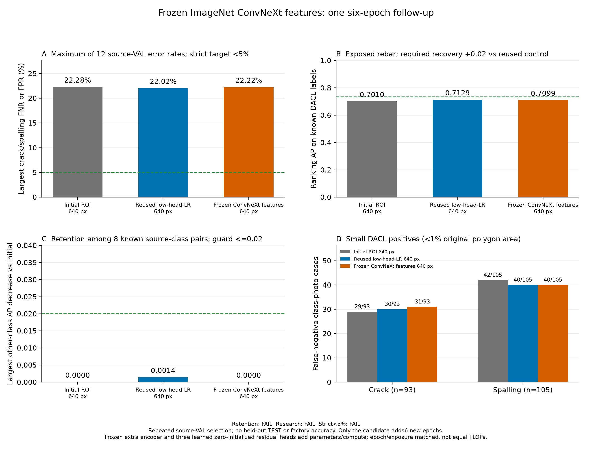

# 동결 ImageNet 특징 보강 후속 실험 결과

기존 저학습률 대조군에서 DACL 박락 오탐85/386과 작은 손상 FN 합계70이 남아, ImageNet ConvNeXt-Tiny의 다른 시각 표현을 추가하는 후보 한 개를 선택했다. 이 관찰은 선택 이유이며 개선 원인이나 개선 보장은 아니다.
완료된 head LR1e-4 대조6epoch를 그대로 재사용했다. 새 후보만 원래0773에서6epoch 학습했다. 새 대조 학습은0epoch이며 과거6epoch를 이번 비용에 다시 더하지 않았다.
원래 AuxiliaryClassifier의324개 state를 그대로 옮겼다. 동결된 ConvNeXt 저층192채널·80×80 특징에는 map7 head, 정규화된 pooled768 특징에는 photo7·aux19 head를 추가했다. 세 head는0으로 초기화해 학습 전7/80/19 출력이 원래 모델과 정확히 일치한다. 새 head의 학습과 encoder 상태 보존은 실제 검증 기록으로 확인한다.
추가 encoder와 pooled LayerNorm은 eval·no_grad로 유지한다. 원래 BatchNorm47개·141버퍼는 기존 통계를 유지하고 γ/β94개·원래 backbone·head 가중치는 학습 가능하다. backbone4e-5/head1e-4, cosine floor5e-6,640입력·80마스크·draw14248·teacher weight4/T2·원래 known/unknown 손실과 표본 순서는 같다.
ImageNet 사전학습·새 특징 경로·파라미터 용량·계산량이 함께 추가되는 방법 비교다. 동일 epoch·노출이며 동일 FLOPs·동일 용량이나 사전학습 특징만의 인과 효과를 주장하지 않는다. 새로운 시설 사진이나 손상 정답은 추가하지 않았다.

| 모델 | 이번 새 epoch | 실제 epoch | 선택 epoch | 최대 검증 미탐·오탐 | 엄격한5% |
|---|---:|---:|---:|---:|---|
| 추가 학습 전 ROI 모델 | 0 | 6 | 6 | 22.28% | 미달 |
| 재사용 저학습률 대조군 | 0 | 6 | 6 | 22.02% | 미달 |
| 동결 ConvNeXt 특징 보강군 | 6 | 6 | 6 | 22.22% | 미달 |

새 후보−초기 최대 오류 -0.06pp, 새 후보−재사용 대조 +0.20pp. 양수는 악화다.
최대값은 균열·박락 × DACL710/Dam424/CODEBRIM611 × FNR/FPR의12개 비율 중 최대다. 전체 사진 오답 비율이나 앱 정확도가 아니다.

## 독립된 기준과 실패 항목

유지 후보: **미달**. 다른 알려진 AP 유지: True; 철근 AP 회복: False; primary 최대 오류 guard: True.
기존 유지 조건은 초기 대비 다른 알려진 AP 하락0.02 이하, 이번 대조의 DACL 철근 AP 대비0.02 이상 회복, 초기·이번 대조 각각 대비 최대 target 오류 악화2pp 이하이다. 높은 대조 AP0.7129에도 회복 기준을 그대로 유지한다.
기존 연구 후보: **미달**. 초기·대조 각각 대비 최대 오류0.5pp 개선·target 악화2pp 이하·다른 알려진 AP 하락0.02 이하·작은 FN 합계2건 감소·항목별 작은 FNR 악화2pp 이하 조건은 바꾸지 않았다.
유지·연구·엄격한5%는 별도 조건이다. 일부 AP 유지 통과를 전체 후보 통과로 표시하지 않는다.

| 출처 | 다른 항목 | 초기 AP | 재사용 AP | 새 AP | 새−초기 | 새−대조 |
|---|---|---:|---:|---:|---:|---:|
| dacl | 녹 흔적 | 0.8771 | 0.8820 | 0.8825 | +0.0054 | +0.0005 |
| dacl | 철근 노출 | 0.7010 | 0.7129 | 0.7099 | +0.0089 | -0.0030 |
| dacl | 젖은 표면 | 0.5127 | 0.5205 | 0.5209 | +0.0082 | +0.0004 |
| dacl | 백화 | 0.7545 | 0.7601 | 0.7587 | +0.0042 | -0.0014 |
| dacl | 공동 | 0.6045 | 0.6030 | 0.6084 | +0.0039 | +0.0053 |
| codebrim | 녹 흔적 | 0.8769 | 0.8940 | 0.8922 | +0.0153 | -0.0018 |
| codebrim | 철근 노출 | 0.9660 | 0.9691 | 0.9690 | +0.0030 | -0.0001 |
| codebrim | 백화 | 0.8298 | 0.8486 | 0.8451 | +0.0153 | -0.0035 |

| 연구 비교 기준 | 최대 오류 개선 | target 회귀 guard | 다른 AP guard | 작은 FN2건 감소 | 작은 항목 FNR guard |
|---|---|---|---|---|---|
| 초기 | 미달 | 통과 | 통과 | 미달 | 미달 |
| 재사용 대조 | 미달 | 통과 | 통과 | 미달 | 통과 |

전체7종의 알려진 조합14개×3모델=42AP, 다른5종의 알려진 조합8개×3모델=24AP를 동일 정답·분모에서 확인했다. AP는 순위 지표이며 정답률이 아니다. 미확인 항목을 정상·0점 AP로 바꾸지 않았다.

| 작은 손상 | 초기 FN/양성 | 재사용 FN/양성 | 새 FN/양성 |
|---|---:|---:|---:|
| 균열 | 29/93 | 30/93 | 31/93 |
| 박락 | 42/105 | 40/105 | 40/105 |

분모는 균열93·박락105의198개 항목·사진 사례이며 같은 사진이 두 항목에 들어갈 수 있다. 고유198사진이나 물리적 손상 크기 정답으로 해석하지 않는다.

## 출처별 관측 오류

| 모델 | 출처 | 항목 | FN/양성 | 미탐률 | FP/음성 | 오탐률 |
|---|---|---|---:|---:|---:|---:|
| 추가 학습 전 ROI 모델 | dacl | 균열 | 47/211 | 22.27% | 110/499 | 22.04% |
| 추가 학습 전 ROI 모델 | damsegment | 균열 | 2/248 | 0.81% | 1/176 | 0.57% |
| 추가 학습 전 ROI 모델 | codebrim | 균열 | 11/149 | 7.38% | 58/462 | 12.55% |
| 추가 학습 전 ROI 모델 | dacl | 박락 | 72/324 | 22.22% | 86/386 | 22.28% |
| 추가 학습 전 ROI 모델 | damsegment | 박락 | 11/58 | 18.97% | 8/366 | 2.19% |
| 추가 학습 전 ROI 모델 | codebrim | 박락 | 15/140 | 10.71% | 42/471 | 8.92% |
| 재사용 저학습률 대조군 | dacl | 균열 | 45/211 | 21.33% | 107/499 | 21.44% |
| 재사용 저학습률 대조군 | damsegment | 균열 | 2/248 | 0.81% | 1/176 | 0.57% |
| 재사용 저학습률 대조군 | codebrim | 균열 | 9/149 | 6.04% | 60/462 | 12.99% |
| 재사용 저학습률 대조군 | dacl | 박락 | 69/324 | 21.30% | 85/386 | 22.02% |
| 재사용 저학습률 대조군 | damsegment | 박락 | 12/58 | 20.69% | 6/366 | 1.64% |
| 재사용 저학습률 대조군 | codebrim | 박락 | 17/140 | 12.14% | 37/471 | 7.86% |
| 동결 ConvNeXt 특징 보강군 | dacl | 균열 | 46/211 | 21.80% | 109/499 | 21.84% |
| 동결 ConvNeXt 특징 보강군 | damsegment | 균열 | 2/248 | 0.81% | 1/176 | 0.57% |
| 동결 ConvNeXt 특징 보강군 | codebrim | 균열 | 9/149 | 6.04% | 58/462 | 12.55% |
| 동결 ConvNeXt 특징 보강군 | dacl | 박락 | 72/324 | 22.22% | 84/386 | 21.76% |
| 동결 ConvNeXt 특징 보강군 | damsegment | 박락 | 12/58 | 20.69% | 6/366 | 1.64% |
| 동결 ConvNeXt 특징 보강군 | codebrim | 박락 | 17/140 | 12.14% | 34/471 | 7.22% |

Wilson95는 JSON에 함께 기록한 고정 예측·독립 사진 가정의 기술 통계다. 반복 VAL·epoch·임계값·후속 방법 선택을 보정한 현장 보장이나 모델 차이 유의성 검정이 아니다.

## 실제 관측 LR와 비용

대조·새 후보의 각 epoch 시작 전 LR6개와 마지막 step6 LR을 모두 실제 optimizer 관측으로 확인했다. 과거 대조 곡선을 새로 계산한 관측으로 표시하지 않는다.

| 모델 | 기존/이번 학습 시간 | allocated peak | 실제 update | AMP skip |
|---|---:|---:|---:|---:|
| 재사용 저학습률 대조군 | 16.11분 | 2.079GiB | 10679 | 7 |
| 동결 ConvNeXt 특징 보강군 | 37.97분 | 2.404GiB | 10679 | 7 |

새 student 총 파라미터 31,085,624, 동결 encoder 27,820,128, 새 학습 head 21,345, 전체 state 510개를 기록했다. 원래 base324와 새 encoder·head state를 구분한다.
공식 사전학습 파일 SHA `983f1562536e84ff750a1576fb08e54de751dbf2e17c0d8a4a13704341fdcd3d`, canonical encoder SHA `712dc4bd02d35026a00afa56e842b33f7100fcb22020bcec74190b4631641d43`를 대조했다. encoder는6epoch 동안 상태·eval·gradient 부재를 유지했다. 새 head의 gradient·nonzero는 각 epoch 마지막 minibatch의 증거이며 모든 update 검증은 아니다.
원본 TRAIN bytes·라벨·마스크·추출 배열·teacher 상태 및 112개 소스·실제 코드 테스트 25개·offline CPU7/80/19 재로딩을 확인했다. 코드 테스트 수는 정확도 사례 수가 아니다.
GPU 시간에는 자료 읽기와 epoch 검증·캐시 영향이 포함된다. 사전학습 파일 취득·preflight·검증 비용과 재사용 과거 학습은 새6epoch 시간에 합산하지 않았다. 추가 encoder의 CPU/모바일 지연이나 현장 처리량은 측정하지 않았다.

## 적용 상태와 한계

한 seed의 반복 공개 source-VAL 연구다. 보류 TEST 추론·앱 자동 승격·새 전문가 확정 라벨·정답 변경·새 시설 사진은 없다. 기본 facility-validation-v2와 프로필 SHA를 유지한다. teacher·ImageNet 특징은 새 손상 정답이 아니다.
공장 시설 정확도·정밀 위치·구조 안전·미래 현장5% 미만을 측정하거나 보장하지 않는다. 새로운 특징이 적용됐다는 사실과 실제 성능 개선 여부를 구분한다.

[고정 조건](facility-semantic-study-protocol.json), [실측 집계](facility-semantic-study-comparison.json), [기술 검증](facility-semantic-study-verification.json)

## 사전 실행 GPU forward 실측

같은 TRAIN 단일 tensor1×3×640×640을 CUDA float32 eval/inference에서 원래 AUX·새 semantic 각각3회 예열·10회 측정했다. NVIDIA GeForce RTX 4070 SUPER에서 원래 평균 3.172ms·중앙 3.125ms, 새 평균 11.902ms·중앙 11.856ms이다.
모델 forward와 CPU dispatch/GPU 동기화를 포함하며 사진 디코딩·전처리·전송·네트워크는 제외했다. 학습 전0-head 모델의 단일 입력 실측이며 앱 Android 지연이나 현장 정확도 평가가 아니다.
