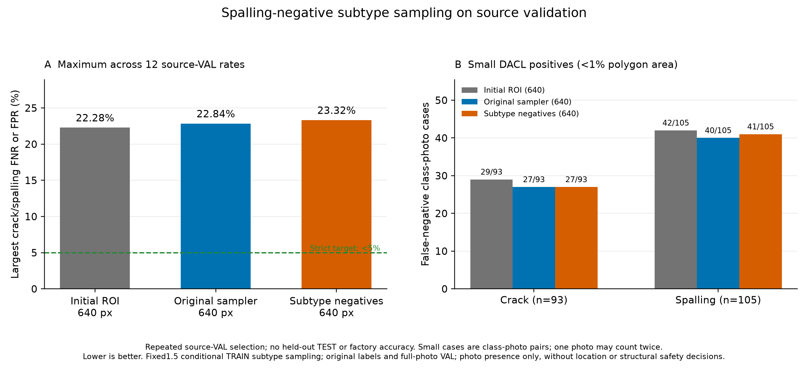

# 박락 음성 하위유형 추출 보강 대조 학습 결과

같은 0773 초기 가중치에서 대조군·보강군을 각 6epoch, 총 12epoch 실제 추가 학습했다. 기존 AUX 구조·640 입력·80×80 마스크·7종 출력·19종 보조 태그를 유지했다.
원본 DACL full TRAIN 중 박락 음성이고 Rockpocket·WConccor·Hollowareas·Cavity 중 하나가 주석된 666개 부모만 후보로 삼았다. 이 태그들을 박락으로 재명명하거나 태그 부재를 정상·안전 정답으로 바꾸지 않았다.
Crack/Spalling 00·10 조합 안에서 조건부 가중치 1.5를 사용했다. 별도 seed59 최대 결합으로 원래 eligible 추출을 모두 유지하고, 같은 조합의 noneligible 행 일부만 후보 행으로 교체했다. 전체 가중치를 일괄 1.5배한 실험이 아니므로 실제 노출 증가가 정확히 1.5배는 아니다.

실제 85,488회 추출 중 1,204위치만 달라졌다. 후보 하위유형 노출은 대조 3,539→보강 4,743회였다. 각 위치의 출처·full/crop·균열/박락 정답은 동일하다. 다른 5종 사진 항목·19종 보조 태그의 노출은 달라질 수 있어 AP 퇴행 방지를 함께 확인했다.

| 모델 | 입력 | 실제 epoch | 선택 epoch | 최대 검증 미탐·오탐 | 엄격한 5% 기준 |
|---|---:|---:|---:|---:|---|
| 추가 학습 전 ROI 모델 | 640 | 6 | 6 | 22.28% | 미달 |
| 원래 추출 대조군 | 640 | 6 | 3 | 22.84% | 미달 |
| 박락 음성 하위유형 보강군 | 640 | 6 | 3 | 23.32% | 미달 |

보강군−초기 모델 최대 오류 +1.04pp, 보강군−새 대조군 +0.48pp. 양수는 악화다.
최대값은 균열·박락 × DACL710/Dam424/CODEBRIM611 × FNR/FPR의 12개 비율 중 최대다. 전체 사진 오답 비율이나 앱 정확도가 아니다.

## 사전 선언한 연구 후보 기준

연구 후보 기준: **미달**. 초기 모델·새 대조군 각각 대비 최대 오류 최소0.5pp 개선, 각 target 비율 악화2pp 이하, 다른 알려진 항목 AP 하락0.02 이하를 요구했다.
작은 DACL 항목·사진 양성 사례 FN 합계도 두 비교 기준 각각보다 최소2건 줄고 항목별 FNR 악화가2pp 이하여야 한다. 연구 후보 조건은 엄격한5%·현장 성능·앱 배포를 뜻하지 않는다.

| 작은 손상 | 초기 FN/양성 | 새 대조 FN/양성 | 보강 FN/양성 |
|---|---:|---:|---:|
| 균열 | 29/93 | 27/93 | 27/93 |
| 박락 | 42/105 | 40/105 | 41/105 |

분모는 균열93·박락105의 198개 항목·사진 사례다. 같은 사진이 두 항목에 포함될 수 있고 고유 사진198장·물리적 손상 크기를 뜻하지 않는다.

## 출처별 관측 오류

Wilson 양측95% 구간은 고정 예측과 독립 사진 가정 아래 기술 통계다. 같은 VAL에서 반복한 epoch·임계값 선택 및 파생 crop 상관을 보정한 확인적 현장 보장이나 모델 간 유의성 검정이 아니다.

| 모델 | 출처 | 항목 | FN/양성 | 미탐률 | Wilson95 | FP/음성 | 오탐률 | Wilson95 |
|---|---|---|---:|---:|---|---:|---:|---|
| 추가 학습 전 ROI 모델 | dacl | 균열 | 47/211 | 22.27% | 17.18%–28.36% | 110/499 | 22.04% | 18.63%–25.89% |
| 추가 학습 전 ROI 모델 | damsegment | 균열 | 2/248 | 0.81% | 0.22%–2.89% | 1/176 | 0.57% | 0.10%–3.15% |
| 추가 학습 전 ROI 모델 | codebrim | 균열 | 11/149 | 7.38% | 4.17%–12.74% | 58/462 | 12.55% | 9.84%–15.89% |
| 추가 학습 전 ROI 모델 | dacl | 박락 | 72/324 | 22.22% | 18.04%–27.06% | 86/386 | 22.28% | 18.41%–26.69% |
| 추가 학습 전 ROI 모델 | damsegment | 박락 | 11/58 | 18.97% | 10.93%–30.85% | 8/366 | 2.19% | 1.11%–4.25% |
| 추가 학습 전 ROI 모델 | codebrim | 박락 | 15/140 | 10.71% | 6.60%–16.93% | 42/471 | 8.92% | 6.66%–11.83% |
| 원래 추출 대조군 | dacl | 균열 | 43/211 | 20.38% | 15.50%–26.32% | 102/499 | 20.44% | 17.13%–24.20% |
| 원래 추출 대조군 | damsegment | 균열 | 5/248 | 2.02% | 0.86%–4.63% | 1/176 | 0.57% | 0.10%–3.15% |
| 원래 추출 대조군 | codebrim | 균열 | 10/149 | 6.71% | 3.69%–11.91% | 62/462 | 13.42% | 10.61%–16.83% |
| 원래 추출 대조군 | dacl | 박락 | 74/324 | 22.84% | 18.60%–27.71% | 87/386 | 22.54% | 18.65%–26.97% |
| 원래 추출 대조군 | damsegment | 박락 | 12/58 | 20.69% | 12.25%–32.77% | 9/366 | 2.46% | 1.30%–4.61% |
| 원래 추출 대조군 | codebrim | 박락 | 17/140 | 12.14% | 7.72%–18.59% | 54/471 | 11.46% | 8.89%–14.66% |
| 박락 음성 하위유형 보강군 | dacl | 균열 | 44/211 | 20.85% | 15.92%–26.83% | 105/499 | 21.04% | 17.69%–24.83% |
| 박락 음성 하위유형 보강군 | damsegment | 균열 | 5/248 | 2.02% | 0.86%–4.63% | 1/176 | 0.57% | 0.10%–3.15% |
| 박락 음성 하위유형 보강군 | codebrim | 균열 | 9/149 | 6.04% | 3.21%–11.08% | 65/462 | 14.07% | 11.19%–17.54% |
| 박락 음성 하위유형 보강군 | dacl | 박락 | 75/324 | 23.15% | 18.89%–28.04% | 90/386 | 23.32% | 19.37%–27.78% |
| 박락 음성 하위유형 보강군 | damsegment | 박락 | 11/58 | 18.97% | 10.93%–30.85% | 11/366 | 3.01% | 1.69%–5.30% |
| 박락 음성 하위유형 보강군 | codebrim | 박락 | 15/140 | 10.71% | 6.60%–16.93% | 52/471 | 11.04% | 8.52%–14.19% |

알려진 출처·항목 AP42개(DACL7/Dam2/CODEBRIM5 ×3모델)를 원래 full VAL 캐시로 재계산하고 정답·순서·양성 분모를 확인했다. 미확인 항목에0점 AP를 만들지 않는다.

## 자원·보존·재현 확인

| 모델 | 학습·epoch 검증 시간 | allocated peak | 실제 update | AMP skip |
|---|---:|---:|---:|---:|
| 원래 추출 대조군 | 24.57분 | 1.872 GiB | 10681 | 5 |
| 박락 음성 하위유형 보강군 | 24.02분 | 1.872 GiB | 10681 | 5 |

학습 전 commit의 49개 실행 소스 바이트와 실제 코드 테스트 28개 통과를 확인했다. 테스트 수는 정확도 평가 사례 수가 아니다. 실제 완료 가중치 두 개는 CPU에서 엄격하게 재로딩하고 finite7/80/19 출력 계약을 확인했다.
원래 TRAIN full14,248·전체26,289행의 사진·마스크·known·정답·순서·기존 추출 가중치·pixel/photo/auxiliary 손실 양성 가중치를 유지했다. 두 군의 optimizer update 수는 AMP overflow로 달라질 수 있으며 건너뛴 update를 epoch와 별도로 기록했다.
과거 native640 PNG pair를 사용하지 않고 원래 historical core manifest를 사용했다. 원본 이미지·주석·체크포인트의 SHA·size·mtime를 검사했다. 시간에는 자료 읽기·epoch 검증·캐시 영향이 포함되며 모바일 추론 시간은 측정하지 않았다.
원래 AP loader 검증 후 유한·비음수·known 분모 이내의 정확한 정수값 float 양성 개수만 int로 표시했다. bool·소수·NaN·무한대는 거부한다. 점수·정답·AP·미탐·오탐·임계값·후보 기준은 바꾸지 않았다.

## 적용 상태와 범위

보류 TEST 추론과 자동 배포·모델 승격은 실행하지 않았다. 앱 기본 `facility-validation-v2` 및 프로필 SHA를 유지했다. 새 독립 사진·새 사진/픽셀 정답·전문가 확정 라벨·원본 라벨 수정은0개다.
TRAIN 감사에서 보인 관련 태그 동시 존재는 오탐 원인의 확정이나 라벨 오류 판정이 아니다. 후보666개는 기존 원본 태그로 정했고 사진별 점수·VAL 오답으로 추출 대상을 바꾸지 않았다.
한 seed와 반복 사용한 공개 교량·댐 콘크리트 자료의 source-VAL 사진 존재 분류 연구다. 공장 시설 사진·정밀 위치 검출·시설 정상/안전 판정·실제 현장 오차율은 측정하지 않았다. 반복 VAL 결과로 향후 현장5% 미만을 보장하지 않는다. 최종 안전 판단은 점검자가 한다.

[사전 고정 조건](facility-subtype-study-protocol.json), [준비한 추출 집계](facility-spalling-sampler-dry-run.json), [실측 집계](facility-subtype-study-comparison.json), [기술 검증](facility-subtype-study-verification.json)
